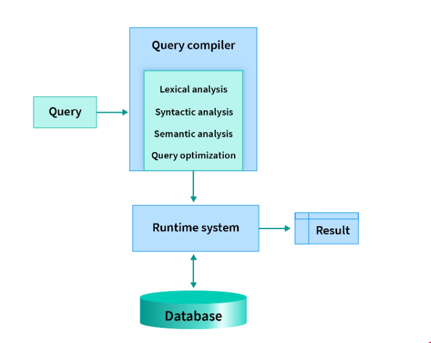
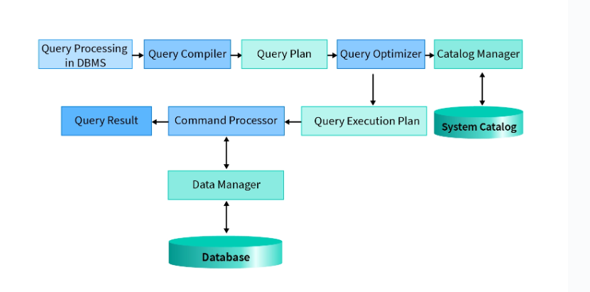
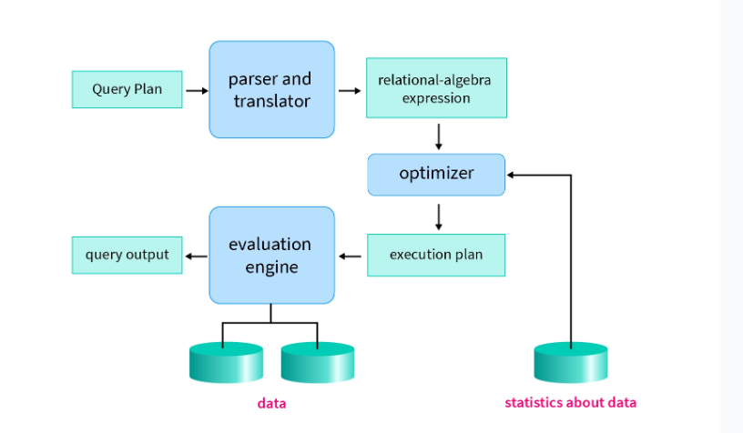

# Buổi 1:
- [Buổi 1:](#buổi-1)
  - [CSDL là gì:](#csdl-là-gì)
  - [Hệ quản trị CSDL là gì:](#hệ-quản-trị-csdl-là-gì)
    - [6 Chức năng của DBMS:](#6-chức-năng-của-dbms)
  - [Câu lệnh tạo database, table trong MS SQL Server](#câu-lệnh-tạo-database-table-trong-ms-sql-server)
  - [Xử lí truy vấn trong SQL:](#xử-lí-truy-vấn-trong-sql)
  - [🔍 Giải thích quy trình xử lý truy vấn trong hệ quản trị cơ sở dữ liệu (DBMS)](#-giải-thích-quy-trình-xử-lý-truy-vấn-trong-hệ-quản-trị-cơ-sở-dữ-liệu-dbms)
    - [🧩 1. Query (Truy vấn)](#-1-query-truy-vấn)
    - [⚙️ 2. Query Compiler (Trình biên dịch truy vấn)](#️-2-query-compiler-trình-biên-dịch-truy-vấn)
      - [a. Lexical analysis (Phân tích từ vựng)](#a-lexical-analysis-phân-tích-từ-vựng)
      - [b. Syntactic analysis (Phân tích cú pháp)](#b-syntactic-analysis-phân-tích-cú-pháp)
      - [c. Semantic analysis (Phân tích ngữ nghĩa)](#c-semantic-analysis-phân-tích-ngữ-nghĩa)
      - [d. Query optimization (Tối ưu hóa truy vấn)](#d-query-optimization-tối-ưu-hóa-truy-vấn)
    - [🏃‍♂️ 3. Runtime System (Hệ thống thực thi)](#️-3-runtime-system-hệ-thống-thực-thi)
    - [🗄️ 4. Database (Cơ sở dữ liệu)](#️-4-database-cơ-sở-dữ-liệu)
    - [📤 5. Result (Kết quả)](#-5-result-kết-quả)
    - [💡 Tóm tắt quy trình:](#-tóm-tắt-quy-trình)
## CSDL là gì:
- Cơ sở dữ liệu (database) là một tập hợp các dữ liệu rời rạc được tổ chức, lưu trữ và quản lý theo hệ thống để có thể dễ dàng truy xuất, chỉnh sửa và cập nhật. Chúng thường được sử dụng để lưu trữ thông tin trong các hệ thống phần mềm và ứng dụng, từ dữ liệu cá nhân cho đến thông tin doanh nghiệp quan trọng. Cơ sở dữ liệu giúp các tổ chức và cá nhân tổ chức dữ liệu một cách có cấu trúc, nhằm mục đích quản lý và xử lý dữ liệu hiệu quả hơn.

- VD: Trong cuộc sống bạn có thể thấy rất nhiều cơ sở dữ liệu đó, nếu bạn vào thư viện thì ở trên đó là một cơ sở dữ liệu, phân loại sách theo chủ đề: xã hội, tự nhiên, khoa học … đó cũng là một dạng cở sở dữ liệu đơn giản.

- **Mục đích ta sử dụng CSDL** là vì cho dễ quản lý và tìm kiếm, thống nhất việc lưu trữ thông tin. Có thể tìm kiếm một cách nhanh chóng khi cần thông tin nào đó và cũng có thể lôi các thông tin liên quan với thông tin đó ra luôn.

## Hệ quản trị CSDL là gì:
- Hệ quản trị cơ sở dữ liệu (Database Management System-DBMS) là một phần mềm được ứng dụng để quản lí và tổ chức các cơ sở dữ liệu. Nó cung cấp các công cụ và chức năng để lưu trữ , truy xuất, cập nhật và xử lí dữ liệu trong các cơ sở dữ liệu.
- DBMS cho phép người dùng tạo, thiết kế và quản lí cơ sở dữ liệu theo cách có tổ chức. Nó hỗ trợ ngôn ngữ truy vấn để truy xuất và thao tác dữ liệu . Đồng thời, DBMS cung cấp các cơ chế bảo mật và kiểm soát truy cập để đảm bảo an ninh và quyền riêng tư của data.
- Với DBMS, người dùng có khả năng quản lí hiệu quả cơ sở dữ liệu và tận dụng các tính năng tiện ích như sao lưu và phục hồi dữ liệu , tối ưu hóa hiệu suất truy vấn. Cũng như đảm bảo tính nhất quán của dữ liệu. Nó là công cụ không thể thiếu để xử lí dữ liệu một cách hiệu quả và đáng tin cậy trong môi trường  kinh doanh và các ứng dụng thông tin khác.
### 6 Chức năng của DBMS:

**Quản lí cấu trúc dữ liệu**

    DBMS cho phép  định nghĩa và quản lí cấu trúc của csdl, bao gồm các bảng, trường , quan hệ và ràng buộc. Đồng thời , đảm nhận vai trò trong việc duy trì dữ liệu cấu trúc trong hệ thống. Chức năng này giúp đảm bảo được tính nhất quán, độ bảo mật và hiệu quả của dữ liệu.

**Lưu trữ dữ liệu**

    Hệ quản trị csdl quản lí việc lưu trữ dữ liệu trên ổ cứng hoặc bộ nhớ. Đảm bảo tính toàn vẹn, chỉnh chu và an toàn của dữ liệu. Ngoài ra , còn quản lí các tệp dữ liệu và cung cấp giao diện cho người dùng. Để thực hiện các hoạt động cơ bản như: Thêm sửa đổi hay truy xuất dữ liệu từ máy.
    
**Truy xuất dữ liệu**

    Quản trị cơ sở dữ liệu cung cấp đầy đủ các công cụ và ngôn ngữ truy cập để xuất dữ liệu ra. Người dùng có thể sử dụng các câu lệnh truy vấn để tìm kiếm, lọc và truy xuất thông tin cần thiết. Đồng thời, nó cũng cung cấp các cơ chế tối ưu hóa truy vấn để đảm bảo được hiệu suất tốt nhất.

**Bảo mật và quản lý quyền truy cập**

    Hệ quản trị cơ sở dữ liệu có thể thiết lập các quyền truy cập và kiểm soát an ninh để bảo vệ dữ liệu khỏi truy cập trái phép hoặc thay đổi không đúng. DBMS cung cấp cơ chế bảo mật đáng tin cậy để đảm bảo được sự an toàn tuyệt đối cho dữ liệu. Mặt khác, cũng có cơ chế mã hóa dữ liệu, kết hợp với các phương pháp khác để dữ liệu không bị “leak” ra bên ngoài.

**Xử lý giao transaction**

    DBMS hỗ trợ xử lý giao dịch (transaction) để đảm bảo tính nhất quán và độ tin cậy của cơ sở dữ liệu khi có nhiều người dùng cùng truy cập và thay đổi dữ liệu. DBMS sử dụng các cơ chế như ghi log và checkpoint để đảm bảo được tính toàn vẹn và độ tin cậy cao. Khả năng phục hồi nhanh chóng trong quá trình xử lý các giao dịch.

**Sao lưu và phục hồi dữ liệu**

    Hệ quản trị cơ sở dữ liệu cung cấp chức năng sao lưu và phục hồi dữ liệu để đảm bảo dữ liệu được bảo vệ và khôi phục sau khi xảy ra lỗi hoặc sự cố. Chức năng sao lưu cho phép tạo các bản sao dữ liệu và lưu trữ nó ở vị trí an toàn nhất. Quá trình sao lưu cần được diễn ra định kỳ để dữ liệu có thể khôi phục khi cần thiết.

## Câu lệnh tạo database, table trong MS SQL Server

```database
-- Tạo database 
create database SQLDBQuery

Câu lệnh tạo database
```
## Xử lí truy vấn trong SQL:
Xử lí truy vấn bao gồm việc trích xuất cơ sở dữ liệu qua nhiều bước. Điều này bao gồm việc dịch các truy vấn cấp cao thành cc biểu thức cấp thấp ở cấp độ vật lí của hệ thống tệp, tối ưu hóa các truy vấn và thực thi chúng để có kết quá thực tế.
- SQL là ngôn ngữ cấp cao không chỉ giúp người dùng dễ dàng truy vấn dữ liệu dựa trên nhu cầu của họ mà còn thu hẹp khoảng cách giao tiếp giữa DBMS, vốn không thực sự hiểu ngôn ngữ của con người. Trên thực tế, Hệ thông DBMS, vốn không thực sự hiểu ngôn ngữ của con người, Trên thực tế , Hệ thống DBMS cơ bản thậm chí sẽ không hiểu các truy vấn SQL này.
- Để chúng hiểu và thực thi 1 truy vấn, trước tiên chúng cần được chuyển đổi sang Ngôn Ngữ Cấp Thấp. Các truy vấn SQL đi qua một đơn vị xử lí chuyển đổi chúng thành ngôn ngữ cấp thấp thông qua Đại số quan hệ trong DBMS.





Như đã đề cập trong hình trên, quá trình xử lí truy vấn có thể được chia thành giai đoạn biên dịch và giai đoạn chạy. Giai đoạn biên dịch bao gồm:
1. Phân tích cú pháp và biên dịch
2. Tối ưu hóa truy vấn
3. Đánh giá(tạo mã)
Tất nhiên rồi 😊 — dưới đây là **phiên bản có thể sao chép** nguyên văn toàn bộ nội dung mình vừa giải thích, được trình bày gọn gàng để bạn dán vào tài liệu, slide, hay ghi chú học tập nhé 👇

---

## 🔍 Giải thích quy trình xử lý truy vấn trong hệ quản trị cơ sở dữ liệu (DBMS)

Hình trên mô tả **quy trình xử lý một câu truy vấn trong DBMS** — tức là cách một câu lệnh (ví dụ SQL) được phân tích, tối ưu và thực thi để lấy ra kết quả từ cơ sở dữ liệu.

---

### 🧩 1. Query (Truy vấn)

Người dùng hoặc ứng dụng gửi một **câu truy vấn** (thường là SQL), ví dụ:
`SELECT * FROM sinhvien WHERE diem > 8;`

Câu truy vấn này sẽ được chuyển đến **Query Compiler (trình biên dịch truy vấn)** để xử lý.

---

### ⚙️ 2. Query Compiler (Trình biên dịch truy vấn)

Query compiler chịu trách nhiệm **phân tích, hiểu và tối ưu hóa** truy vấn trước khi thực thi.
Nó gồm 4 giai đoạn chính:

#### a. Lexical analysis (Phân tích từ vựng)

* Chia truy vấn thành các **token** – những đơn vị nhỏ như từ khóa (`SELECT`, `FROM`), tên bảng (`sinhvien`), toán tử (`>`, `=`)…
* Kiểm tra lỗi từ vựng (ví dụ: viết sai cú pháp SQL).

#### b. Syntactic analysis (Phân tích cú pháp)

* Kiểm tra cấu trúc của câu truy vấn có hợp lệ theo **ngữ pháp SQL** không.
  Ví dụ: `SELECT diem WHERE sinhvien > 8;` là sai cú pháp.
* Kết quả bước này là **cây cú pháp (parse tree)** biểu diễn cấu trúc logic của truy vấn.

#### c. Semantic analysis (Phân tích ngữ nghĩa)

* Kiểm tra ý nghĩa của câu truy vấn:

  * Tên bảng, cột có tồn tại không?
  * Kiểu dữ liệu có phù hợp không?
  * Các ràng buộc khóa ngoại, khóa chính có hợp lệ không?
* Ví dụ: Nếu bảng `sinhvien` không có cột `diemthi`, thì hệ thống sẽ báo lỗi ở bước này.

#### d. Query optimization (Tối ưu hóa truy vấn)

* Tạo ra **kế hoạch thực thi (execution plan)** tốt nhất để lấy dữ liệu nhanh nhất.
* So sánh nhiều cách thực hiện (dùng chỉ mục, thứ tự join bảng, cách truy xuất file, v.v.)
* Kết quả là một **query plan** được gửi cho **Runtime System**.

---

### 🏃‍♂️ 3. Runtime System (Hệ thống thực thi)

* Nhận kế hoạch thực thi từ compiler.
* Gửi **các lệnh cụ thể** đến **Database** (ví dụ: quét bảng, truy cập index, lọc hàng…).
* Quản lý bộ nhớ, truy cập đĩa, và luồng dữ liệu giữa các bước.

---

### 🗄️ 4. Database (Cơ sở dữ liệu)

* Chứa **dữ liệu vật lý** được lưu trữ trên đĩa.
* Runtime system truy cập dữ liệu thật ở đây theo kế hoạch đã được tối ưu.

---

### 📤 5. Result (Kết quả)

* Sau khi dữ liệu được lấy, lọc và xử lý xong, kết quả cuối cùng được gửi trả về người dùng.

---

### 💡 Tóm tắt quy trình:

| Giai đoạn      | Thành phần chính                           | Mục tiêu                    |
| -------------- | ------------------------------------------ | --------------------------- |
| Query          | Người dùng nhập truy vấn                   | Gửi yêu cầu                 |
| Query Compiler | Lexical, Syntactic, Semantic, Optimization | Phân tích & tối ưu truy vấn |
| Runtime System | Trình thực thi                             | Thực hiện kế hoạch          |
| Database       | Nơi lưu dữ liệu                            | Cung cấp dữ liệu thực       |
| Result         | Kết quả trả về                             | Hiển thị cho người dùng     |

---


