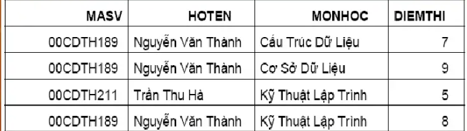
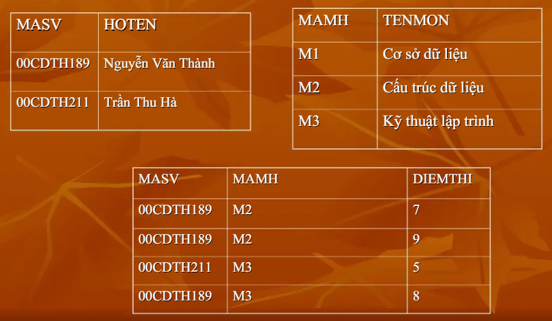
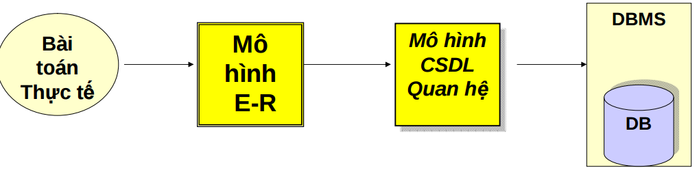
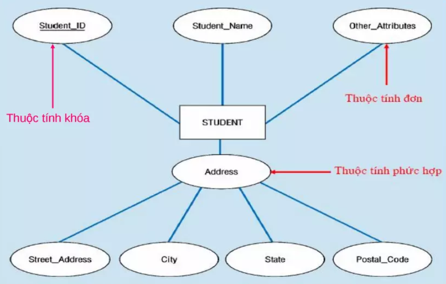
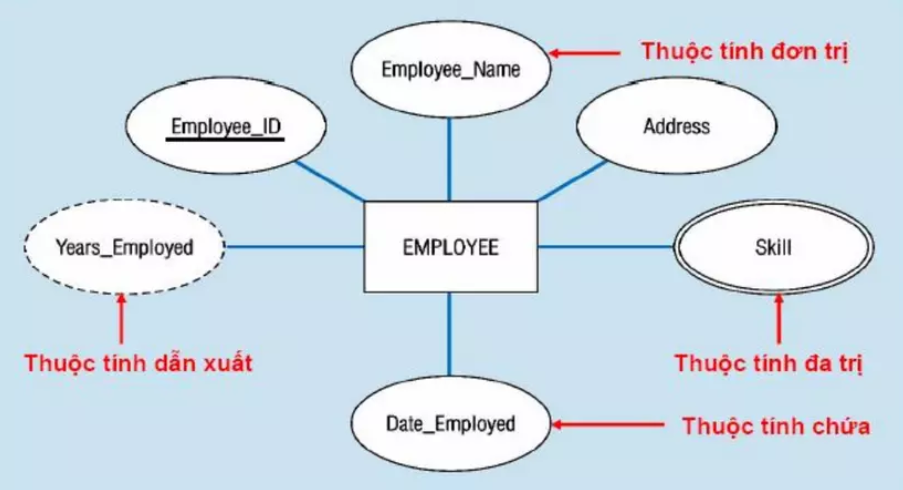
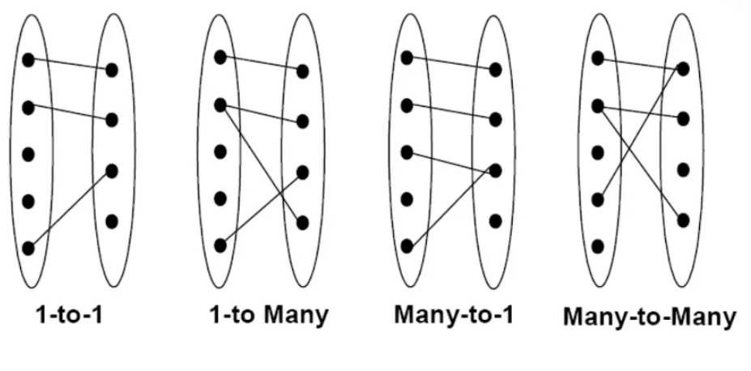
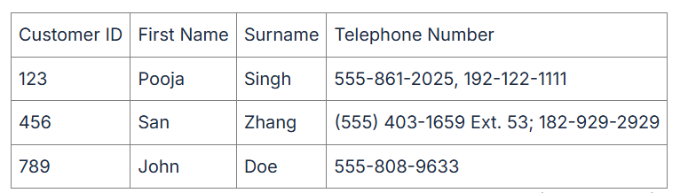
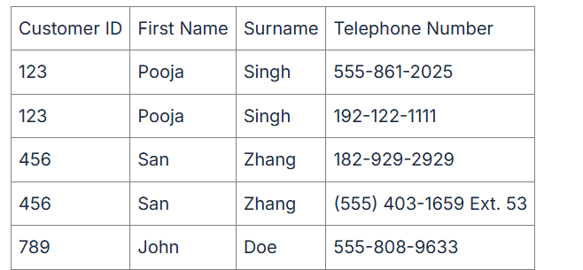

# Buổi 2: CƠ BẢN VỀ THIẾT KẾ CƠ SỞ DỮ LIỆU

- [Buổi 2:](#buổi-2-cơ-bản-về-thiết-kế-cơ-sở-dữ-liệu)
  - [Tổng quan về cơ sở dữ liệu](#tổng-quan-về-cơ-sở-dữ-liệu)

## Tổng quan về cơ sở dữ liệu:
### các vấn đề gặp phải khi tổ chức cơ sở dữ liệu:
+ Trước khi bàn về cách thiết kế cơ sở dữ liệu tốt, chúng ta hãy phân tích xem tại sao trong một số lược đồ tồn tại ở những vấn đề sau Timeline cho lược đồ quan hệ:
**Thi(MASV,HOTEN,MONONGỌC,DIEMTHI)**
Và sau đây là một quan hệ trên lược đồ quan hệ thi

1, Dư thừa(Dự phòng):Họ tên của các thí sinh được lặp lại cho mỗi môn thi.
2, Dự trữ ẩn khi cập nhật. Do dư thừa hậu quả, chúng tôi có thể truy cập nhật tên của một sinh viên trong một bộ nào đó nhưng vẫn để lấy lại tên cũ của họ trong những bộ khác. Vì vậy chúng ta có thể không có tên duy nhất của họ đối với mỗi sinh viên như chúng ta mong muốn.
3, Bất lợi khi chèn. chung ta không thể biết tên của một sinh viên nếu hiện tại sinh viên đó không dự thi môn nào.
4, Bất bình thường khi xóa. Ngược lại với vấn đề 3 có vấn đề chúng ta có thể xóa đi tất cả các môn học của một sinh viên, vô ý làm mất dấu vết để tìm ra họ tên của sinh viên này.
+ Những vấn đề nêu trên sẽ được giải quyết  nếu chúng ta phân rã lược đồ quan hệ Diemthi thành ba lược đồ quan hệ:
    + SinhVien(MASV,HOTEN)
    + MonHoc(MAMH,TENMON)
    + Ketqua(MASV,MAMH,DIEMTHI)

Ưu điểm: Lược đồ quan hệ SinhVien cho biết họ tên của mỗi sinh viên chỉ xuất hiện đúng một lần; do vậy không có dư thừa. Ngoài ra chúng ra có thể nhập họ tên của một sinh viên dù hiện tại sinh viên đó chưa có kết quả thi môn nào.
Nhược điểm: Tuy nhiên lúc này ta nhận thấy rằng để tìm danh sách họ tên của các sinh viên ứng với môn thi cơ sở dữ liệu thì chúng ta phải thực hiện một phép kết nối, còn với một quan hệ duy nhất thi chúng ta có thể dễ dàng trả lời bằng cách thực hiện một phép chọn rồi phép chiếu.
=> làm sao để đưa được một lược đồ cơ sở dữ liệu chưa tốt về một lược đồ cơ sở dữ liệu tốt hơn?
### Phụ thuộc hàm
+ Phụ thuộc hàm (functional dependancy) là một công cụ dùng để biểu diễn một cách hình thức các ràng buộc toàn vẹn. Phương pháp biễu diễn này có rất nhiều ưu điểm, và đây là một công cụ cực kỳ quan trọng, gắn chặt với lý thiết thiết kế dữ liệu.

+ **Định nghĩa phụ thuộc hàm:**
  + Cho lược đồ quan hệ Q(U) , U={A1,A2,...,An}. X,Y là 2 tập con rỗng của U. Ta nói X xác định Y(hay Y phụ thuộc vào X) nếu với r là một quan hệ nào đó trên Q
  + Chẳng hạn như phụ thuộc hàm của thuộc tính họ tên của sinh viên(HOTENSV) và mã số sinh viên (MASV) và ta có thể diễn tả phụ thuộc hàm: MASV -> HOTENSV
  + Phụ thuộc hàm X -> X được gọi là phụ thuộc hàm hiển nhiên. người ta thường dùng F để chỉ tập các phụ thuộc hàm định nghĩa trên U. vì Y hữu hạn nên F cũng hữu hạn, ta có thể đánh số các phụ thuộc hàm của F là f1,f2,...,fm.
  + Quy ước: chỉ cần mô tả các phụ thuộc hàm hiển nhiên được ngầm hiểu là đã có trong F.
  
  
+ **Cách xác định các phụ thuộc hàm cho LDQH**
  + Cách duy nhất để xác định đúng các phụ thuộc thích hợp cho một lược đồ quan hệ là xem xét nội dung tân từ của lược đồ quan hệ đó
  + Chẳng hạn với lược đồ cơ sở dữ liệu đã cho trong ví dụ trên thì phụ thuộc hàm với từng lược đồ quan hệ được xác định như sau:
  + MASV -> HOTENSV,GIOITINH,NGAYSINH,MALOP,TINH
  + MALOP ->  TENLOP,MAKHOA
  + MAKHOA -> TENKHOA
  + MAMH -> TENMH,DONVIHT
  + MASV,MAMH,LANTHI -> DIEMTHI
+ Một số tính chất của phụ thuộc hàm:
  + Hệ tiên đề Armstrong
  + Để có thể xác định được các phụ thuộc hàm khác từ tập phụ thuộc hàm đã có, ta dùng hệ tiên đề Armstrong(1974), gốm các luật sau:
1. luật phản xạ(reflexivity):
    Nếu X C Y thì -> Y->X
2. Luật Tăng Trưởng(augmentation):
    Nếu X -> Y thì XZ -> YZ
3. Luật bắc cầu(transitivity):
   Nếu X -> Y, Y->Z thì X->Z
Các quy tắc suy rộng:
4. luật hợp(the union rule):
   Nếu X ->Y, X->Z thì X -> YZ
5. luật bắc cầu giả
    Cho X-> Y , WY -> X thì XW -> Z
6. Luật phân rãL
    cho X -> YZ thì X->Y và X -> Z
### Báo Đóng của tập phụ thuộc hàm và bao đóng của tập thuộc tính
Bao đóng của tập phụ thuộc hàm F(Kí hiệu là F+) là tập hợp tất cả các phục thuộc hàm có thể suy ra từ F dựa vào các tiên đề Armstrong.
### Khóa của lược đồ quan hệ - một số thuật toán tìm khóa.
+ Cho quan hệ Q(u) , U =(A1,A2,...,An) được xác định bởi tập thuộc tính U và tập phụ thuộc hàm F định nghĩa trên Q,cho K C U, K là một khóa của Q nếu thõa mãn đồng thời cả hai điều kiện sau:

1. K -> U thuộc F+ (K chỉ thõa mãm một điều kiện thì được gọi là siêu khóa)
2. không tồn tại K' C K sao cho K'+ = U.
Một lược đồ quan hệ có thể có nhiều siêu khóa , nhiều khóa.
### Phủ tối thiểu(minimal cover)

+ Phủ tối thiểu (Minimal Cover) trong Cơ sở dữ liệu (CSDL) là một khái niệm quan trọng trong thiết kế lược đồ quan hệ. Nó được dùng trong quá trình chuẩn hoá để đơn giản hoá tập phụ thuộc hàm (Functional Dependencies - FDs) mà vẫn giữ nguyên tính tương đương logic.
**Phủ tối thiểu (Minimal Cover)** trong **Cơ sở dữ liệu (CSDL)** là một khái niệm quan trọng trong **thiết kế lược đồ quan hệ**. Nó được dùng trong quá trình **chuẩn hoá** để đơn giản hoá tập phụ thuộc hàm (Functional Dependencies - FDs) mà vẫn **giữ nguyên tính tương đương logic**.

---

### 🔹 1. Khái niệm

**Phủ tối thiểu** của một tập phụ thuộc hàm ( F ) là một tập phụ thuộc hàm ( G ) sao cho:

* ( G ) **tương đương logic** với ( F ) (tức là ( F^+ = G^+ )),
* Mỗi phụ thuộc trong ( G ) có **vế phải chỉ gồm một thuộc tính**,
* **Không thể loại bỏ** bất kỳ phụ thuộc nào hoặc thuộc tính nào trong ( G ) mà vẫn giữ tính tương đương logic.

Nói cách khác, phủ tối thiểu là **dạng rút gọn nhất** của các phụ thuộc hàm mà không làm mất thông tin.

---

### 🔹 2. Các bước tìm phủ tối thiểu

Giả sử ta có tập phụ thuộc hàm ( F ):

#### **Bước 1:** Chuẩn hóa vế phải

Chuyển tất cả các phụ thuộc có nhiều thuộc tính bên phải thành nhiều phụ thuộc có **1 thuộc tính vế phải**.

> Ví dụ:
> ( A \to BC )
> ⟹ ( A \to B ), ( A \to C )

---

#### **Bước 2:** Loại bỏ thuộc tính dư ở vế trái

Với mỗi phụ thuộc ( X \to Y ) trong tập, nếu tồn tại thuộc tính ( A \in X ) sao cho:
[
(Y \subseteq (X - {A})^+)
]
thì **A là thuộc tính dư**, và ta có thể bỏ A khỏi vế trái.

---

#### **Bước 3:** Loại bỏ phụ thuộc dư

Với mỗi phụ thuộc ( f \in F ), kiểm tra nếu ( f ) có thể **suy ra từ ( F - {f} )**, tức là:
[
f \in (F - {f})^+
]
thì ( f ) là phụ thuộc dư và có thể loại bỏ.

---

### 🔹 3. Ứng dụng của phủ tối thiểu

* Giúp **chuẩn hoá lược đồ quan hệ** (tách bảng) mà không mất thông tin.
* Dùng trong **phân tích khóa** của lược đồ.
* Giúp **rút gọn tập phụ thuộc hàm**, làm rõ mối quan hệ giữa các thuộc tính.

---

Nếu bạn muốn, mình có thể giúp bạn **viết thuật toán tìm phủ tối thiểu** (dưới dạng pseudocode hoặc Python) hoặc **giải chi tiết một bài tập cụ thể** — bạn muốn mình làm theo hướng nào?

##  Lược đồ quan hệ E-R và - Mô hình dữ liệu quan hệ.
### 1 - Vai trò của mô hình E-R trong quá trình thiết kế cơ sở dữ liệu:
Mục tiêu của mô hình E-R trong quá trình thiết kế cơ sở dữ liệu đó là phân tích dữ liệu, xác định các đơn vị thông tin cơ bản cần thiết của tổ chức, mô tả cấu trúc và mối liên hệ giữa chúng

E-R là mô hình trung gian để chuyển những yêu cầu quản lý dữ liệu trong thế giới thực thành mô hình cơ sở dữ liệu quan hệ

### 2 - Các thành phần cơ bản của mô hình E-R

**a - Thực thể và tập thực thể**:
Thực thể là một đối tượng trong thế giới thực.

Một nhóm bao gồm các thực thể tương tự nhau tạo thành một tập thực thể

Việc lựa chọn các tập thực thể là một bước vô cùng quan trọng trong việc xây dựng sơ đồ về mối quan hệ thực thể

Ví dụ: “Quản lý các dự án của công ty”

  + Một nhân viên là một thực thể
  + Tập hợp các nhân viên là tập thực thể
  + Một dự án là một thực thể
  + Tập hợp các dự án là tập thực thể
  + Một phòng ban là một thực thể
  + Tập hợp các phòng ban là tập thực thể

**b - Thuộc tính**

Mỗi tập thực thể có một tập các tính chất đặc trưng, mỗi tính chất đặc trưng này gọi là thuộc tính của tập thực thể. Ứng với mỗi thuộc tính có một tập các giá trị cho thuộc tính đó gọi là miền giá trị.

**Miền giá trị của thuộc tính gồm các loại giá trị như sau:**
+ Kiểu chuỗi (string)
+ Kiểu số nguyên (integer)
+ Kiểu số thực (real)
...4

**Thuộc tính bao gồm các loại như sau:**
+ Thuộc tính đơn – không thể tách nhỏ ra được
+ Thuộc tính phức hợp – có thể tách ra thành các thành phần nhỏ hơn 

**Các loại giá trị của thuộc tính:**
+ Đơn trị: các thuộc tính có giá trị duy nhất cho một thực thể (VD: số CMND, …)
+ Đa trị: các thuộc tính có một tập giá trị cho cùng một thực thể (VD: bằng cấp, …)
+ Suy diễn được (năm sinh <----> tuổi)

Mỗi thực thể đều được phân biệt bởi thuộc tính khóa

**c - Mối quan hệ giữa các tập thực thể:**

Quan hệ là sự liên kết giữa hai hay nhiều tập thực thể

Ví dụ giữa tập thực thể NHANVIEN và PHONGBAN có các liên kết như sau:

+ Một nhân viên thuộc một phòng ban nào đó
+ Một phòng ban có một nhân viên làm trưởng phòng

Tập quan hệ là tập hợp các mối quan hệ giống nhau

**d - Lược đồ E-R:**
Là đồ thị biểu diễn các tập thực thể, thuộc tính và mối quan hệ

Các ký hiệu trong lược đồ E-R

+ Đỉnh:

+ Cung: là đường nối giữa tập thực thể và thuộc tính, mối quan hệ và tập thực thể

Ví dụ lược đồ E-R:

**e - Các kiểu liên kết trong lược đồ E-R:**

**f - Thuộc tính khóa:**
Mỗi tập thực thể phải có 1 khóa

Một khóa có thể có 1 hay nhiều thuộc tính

Có thể có nhiều khóa trong 1 tập thực thể, ta sẽ chọn ra 1 khóa làm khóa chính cho tập thực thể đó
**3 - Xây dựng mô hình E-R**

**a - Quy tắc:**

+ Chính xác
+ Tránh trùng lặp
+ Dễ hiểu
+ Chọn đúng mối quan hệ
+ Chọn đúng kiểu thuộc tính

**b - Các bước xây dựng:**

+ Liệt kê, chọn lọc thông tin
+ Xác định tập thực thể
+ Xác định mối quan hệ
+ Xác định thuộc tính và gắn thuộc tính cho tập thực thể và mối quan hệ
+ Quyết định thuộc tính khóa
+ Vẽ biểu đồ mô hình thực thể E-R
+ Chuẩn hóa biểu đồ

##  Chuẩn hóa dữ liệu: 1NF, 2NF, 3NF.

### 1. Chuẩn hóa dữ liệu là gì:
**Chuẩn hóa dữ liệu** là quá trình biểu diễn cơ sở dữ liệu dưới dạng chuẩn. Đây là một kỹ thuật thiết kế bảng trong cơ sở dữ liệu, chia các bảng lớn thành các bảng nhỏ hơn và liên kết chúng bằng các mối quan hệ. 

Quá trình này diễn ra với mục đích là loại bỏ hoặc làm giảm sự dư thừa và phụ thuộc của dữ liệu.

### 2. Các dạng chuẩn hóa cơ bản
Có 4 dạng cơ bản là dạng chuẩn: 1NF, 2NF, 3NF và BCNF. Các dạng chuẩn hóađược sắp xếp từ thấp đến cao. Để chuẩn hóa 2NF thì cơ sở dữ liệu của chúng ta phải đạt chuẩn 1NF, tương tự nếu muốn đạt chuẩn 3NF thì phải đạt chuẩn 1 NF và 2 NF. Chuẩn BCNF sẽ bao gồm 3 loại chuẩn là 1NF, 2NF và 3NF.
#### 2.1 Dạng chuẩn 1NF

Một bảng cơ sở dữ liệu được gọi là ở dạng chuẩn hóa dữ liệu 1NF khi toàn bộ các miền giá trị của các cột trong bảng đều chỉ chứa các giá trị nguyên tử (nguyên tố) và mỗi cột chỉ chứa một giá trị từ miền.

Ví dụ về bảng lưu trữ tên và số điện thoại của khách hàng:

Bảng này đang vi phạm 1NF vì cột Telephone Number chứa nhiều giá trị (nhiều số điện thoại) nên các giá trị trong cột không phải là nguyên tố mà có thể được chia thành hai số. 

Chỉnh sửa để đưa về dạng chuẩn 1NF:

#### 2.2 Dạng chuẩn 2NF
Một quan hệ đủ tiêu chí là dạng chuẩn hóa dữ liệu 2NF nếu quan hệ đó:

+ Là 1NF
+ Các thuộc tính không khoá phải phụ thuộc hàm đầy đủ vào khoá chính
**Ví dụ 1**: Cho quan hệ R = (ABCD), khoá chính là AB và tập phụ thuộc hàm là F = {AB => C, AB => D} là quan hệ đạt chuẩn 2NF.

**Ví dụ 2**: Cho quan hệ R = (ABCD), khoá chính là AB và tập phụ thuộc hàm là F = {AB => C, AB => D, B => DC} là quan hệ không đạt chuẩn 2NF vì có B => DC là phụ thuộc hàm không đầy đủ vào khoá chính

#### 2.3 Dạng chuẩn 3NF 
Một quan hệ đủ tiêu chí là dạng chuẩn hóa dữ liệu 3NF nếu quan hệ đó: 
+ Là 2NF
+ Các thuộc tính không khóa phải phụ thuộc trực tiếp vào khóa chính

**Ví dụ 1**: Cho quan hệ R = (ABCDGH), khoá chính là AB và tập phụ thuộc hàm F = {AB -> C, AB -> D, AB -> GH} là quan hệ đạt chuẩn 3NF.

**Ví dụ 2**: Cho quan hệ R = (ABCDGH) , khoá là AB và tập phụ thuộc hàm F = {AB -> C, AB -> D, AB -> GH, G -> DH}. Đây là quan hệ không đạt chuẩn 3NF vì có G -> DH là phụ thuộc hàm gián tiếp vào khoá

#### 2.4 Dạng chuẩn BCNF (Boyce - Codd)
Một quan hệ đạt chuẩn BCNF nếu quan hệ đó:

+ Là 3NF
+ Không có thuộc tính khoá mà phụ thuộc hàm vào thuộc tính không khoá.

Ví dụ 1: Cho quan hệ R = (ABCDGH), khoá là AB và tập phụ thuộc hàm F = {AB -> C, AB -> D, AB -> GH} là quan hệ đạt chuẩn BCNF.

Ví dụ 2: Cho quan hệ R = (ABCDGH) , khoá là AB và tập phụ thuộc hàm F = {AB -> C, AB -> D, AB -> GH, H -> B}. Đây là quan hệ không đạt chuẩn hóa dữ liệu BCNF vì có thuộc tính khoá B phụ thuộc hàm vào thuộc tính không khoá H