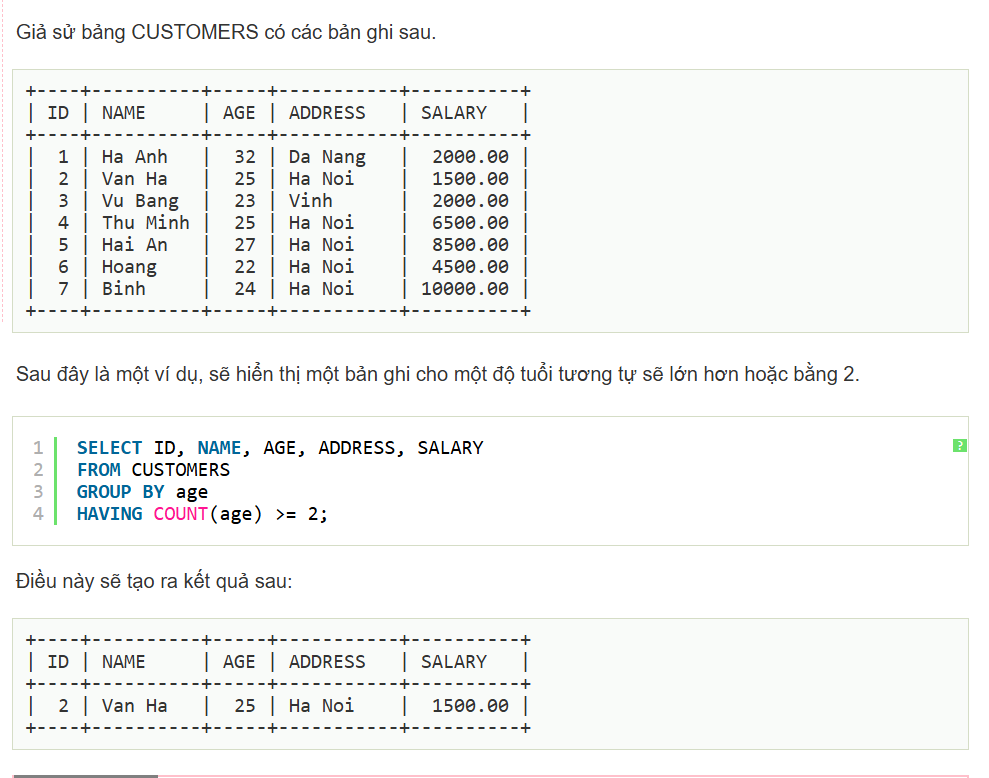

# Buổi 3:


## Table:
1. Thêm cột
a, Thêm một cột:
```
Alter table table_name:
Add column_name datatypes;
```
b, Xóa một cột:
```
Alter table table_name:
Drop column column_name;
```
c, Đổi tên cột:

```
Alter table table_name:
Rename column old_name to new_name;
```
d,Sửa đổi kiểu dữ liệu của cột:
```
Alter table table_name:
Modify column column_name datatype;
```
2. Drop Table
Xóa bảng.

## Constraint(Ràng buộc):
1. not null
2. Unique : dùng để phân định ra các giá trị riêng trong table của bạn
3. Primary Key
4. Foreign key
5. Check
6. Default
## Các thao tác cơ bản: SELECT, INSERT, UPDATE, DELETE, từ khóa AS, DISTINCT

1. INSERT:
Thêm record vào table.
```database
INSERT INTO table_name(column1,column2,column3,...)
Value (value1, value2,value3,...);
```
Lưu ý: có thể thêm nhiệu cột một lúc.

Ví dụ:
```database
USE btvn1;

CREATE table user(
	userid int auto_increment primary key,
    username varchar(100),
    password1 varchar(100)
);

insert into user(username,password1)
values
("Nguyen","12345"),
("Trong","123456"),
("Toan" , "1244");
```
2. UPDATE:

Cập nhật data của Record ở table

Câu lệnh
```
UDATE table_name
SET column1 = value1, column2 = value2,...
Where condition;
```
Ví dụ:
```
update user 
set password1 = 1
where userid = 4;
```
Kết quả:


3. DELETE:
Xóa thông tin của một cột:

Câu lệnh:
```
DELETE from doctor
Where khóa chính
```
ví dụ:
```
delete from user
where userid = 4
```


4. SELECT:

Lấy thông tin từ table:

```
SELECT column1,column2,...
from table_name
```


Lấy thông tin dựa vào điều kiện:

```
SELECT column1,column2,...
from table_name
where condition;
```


5. SELECT LIMIT
Giới hạn số lượng record lấy ra.

6. Từ khóa DISTINCT để loại bỏ các bản ghi trùng lặp :

Ví dụ :
```
SELECT distinct username FROM btvn1.user
```
Kết quả:


7. Từ khóa AS được dùng để đặt bí danh cho bảng hoặc cột trong truy vấn. Việc sử dụng bí danh giúp làm cho các truy vấn dễ đọc và dễ hiểu hơn. 

Cú pháp cơ bản:

**Bí danh cho cột**: SELECT column_name AS alias_name FROM table_name;

**Bí danh cho bảng**: SELECT column1, column2 FROM table_name AS alias_name;

## Lọc dữ liệu: WHERE, HAVING

* WHERE:
  * Mệnh đề WHERE trong SQL được sử dụng để chỉ định một điều kiện trong khi lấy dữ liệu từ một bảng hoặc bằng cách join với nhiều bảng. Nếu điều kiện thỏa mãn, thì nó trả về một giá trị cụ thể từ bảng. Bạn nên sử dụng mệnh đề WHERE để lọc các bản ghi và chỉ lấy các bản ghi cần thiết.

  * Mệnh đề WHERE không chỉ được sử dụng trong câu lệnh SELECT, mà nó còn được sử dụng trong câu lệnh UPDATE, DELETE, vv, mà sẽ được đề cập đến trong các bài tiếp theo.
Ví dụ: đã có trên các ví dụ trên rồi.

* HAVING:
  * Mệnh đề HAVING trong SQL cho phép bạn chỉ định điều kiện lọc mà kết quả nhóm xuất hiện trong kết quả.

  * Mệnh đề WHERE đặt các điều kiện vào các cột đã chọn, trong khi mệnh đề HAVING đặt các điều kiện vào các nhóm được tạo bởi mệnh đề GROUP BY.


## Kết hợp bảng và kết quả: JOIN, UNION

JOIN:
Inner JOIN:
Lệnh **Inner Join** trong SQL tạo một bảng kết quả mới bằng cách kết hợp các giá trị cột của hai bảng (table1 và table2) dựa trên điều kiện nối. Truy vấn so sánh từng hàng của table1 với từng hàng của table2 để tìm tất cả các cặp hàng thỏa mãn điều kiện nối. Khi điều kiện nối được thỏa mãn, các giá trị cột cho mỗi cặp hàng A và B phù hợp sẽ được kết hợp thành một hàng kết quả.
Ví dụ:

```
SELECT table1.column1, table2.column2...
FROM table1
INNER JOIN table2
ON table1.common_field = table2.common_field;
```

Chắc chắn rồi\! Dưới đây là toàn bộ nội dung tổng hợp về các loại `JOIN` phổ biến trong SQL. Bạn chỉ cần sao chép toàn bộ nội dung này.

-----

## Tổng Hợp Các Loại JOIN trong SQL

`JOIN` là mệnh đề được sử dụng để kết hợp các hàng từ hai hoặc nhiều bảng dựa trên một cột có liên quan giữa chúng.

### Bảng Dữ Liệu Ví Dụ

Chúng ta sẽ sử dụng hai bảng sau để minh họa:

**Bảng 1: `KhachHang`**
| ID\_KhachHang | TenKhachHang | ThanhPho |
| :--- | :--- | :--- |
| 1 | Nguyễn Văn An | Hà Nội |
| 2 | Trần Thị Bình | Đà Nẵng |
| 3 | Lê Văn Cường | TP. HCM |
| 4 | Phạm Thị Dung | Hà Nội |

**Bảng 2: `DonHang`**
| ID\_DonHang | ID\_KhachHang | NgayDatHang |
| :--- | :--- | :--- |
| 101 | 3 | 2025-10-15 |
| 102 | 1 | 2025-10-16 |
| 103 | 3 | 2025-10-16 |
| 104 | 5 | 2025-10-17 |

-----

### 1\. `INNER JOIN` (JOIN Trong)

`INNER JOIN` trả về các bản ghi có giá trị khớp ở cả hai bảng. Đây là loại `JOIN` được sử dụng phổ biến nhất.

**Ví dụ**: Lấy danh sách các đơn hàng cùng với thông tin của khách hàng đã đặt hàng đó.

```sql
SELECT KhachHang.TenKhachHang, DonHang.ID_DonHang, DonHang.NgayDatHang
FROM KhachHang
INNER JOIN DonHang ON KhachHang.ID_KhachHang = DonHang.ID_KhachHang;
```

**Kết quả:**

| TenKhachHang | ID\_DonHang | NgayDatHang |
| :--- | :--- | :--- |
| Lê Văn Cường | 101 | 2025-10-15 |
| Nguyễn Văn An | 102 | 2025-10-16 |
| Lê Văn Cường | 103 | 2025-10-16 |

➡️ **Giải thích**: Chỉ những khách hàng có `ID_KhachHang` xuất hiện trong cả hai bảng (`1` và `3`) mới được hiển thị.

-----

### 2\. `LEFT JOIN` (JOIN Trái)

`LEFT JOIN` trả về tất cả các bản ghi từ bảng bên trái (`KhachHang`) và các bản ghi khớp từ bảng bên phải (`DonHang`). Nếu không có sự trùng khớp, kết quả sẽ là `NULL` ở các cột của bảng bên phải.

**Ví dụ**: Lấy danh sách **tất cả** khách hàng và các đơn hàng của họ (nếu có).

```sql
SELECT KhachHang.TenKhachHang, DonHang.ID_DonHang
FROM KhachHang
LEFT JOIN DonHang ON KhachHang.ID_KhachHang = DonHang.ID_KhachHang;
```

**Kết quả:**

| TenKhachHang | ID\_DonHang |
| :--- | :--- |
| Nguyễn Văn An | 102 |
| Trần Thị Bình | NULL |
| Lê Văn Cường | 101 |
| Lê Văn Cường | 103 |
| Phạm Thị Dung | NULL |

➡️ **Giải thích**: Tất cả khách hàng trong bảng `KhachHang` đều được liệt kê. Những khách hàng chưa đặt đơn hàng nào sẽ có giá trị `NULL` ở cột `ID_DonHang`.

-----

### 3\. `RIGHT JOIN` (JOIN Phải)

`RIGHT JOIN` hoạt động ngược lại với `LEFT JOIN`. Nó trả về tất cả các bản ghi từ bảng bên phải (`DonHang`) và các bản ghi khớp từ bảng bên trái (`KhachHang`).

**Ví dụ**: Lấy danh sách **tất cả** các đơn hàng và thông tin khách hàng tương ứng (nếu có).

```sql
SELECT KhachHang.TenKhachHang, DonHang.ID_DonHang
FROM KhachHang
RIGHT JOIN DonHang ON KhachHang.ID_KhachHang = DonHang.ID_KhachHang;
```

**Kết quả:**

| TenKhachHang | ID\_DonHang |
| :--- | :--- |
| Lê Văn Cường | 101 |
| Nguyễn Văn An | 102 |
| Lê Văn Cường | 103 |
| NULL | 104 |

➡️ **Giải thích**: Tất cả các đơn hàng trong bảng `DonHang` đều được liệt kê. Đơn hàng `104` có `ID_KhachHang` không tồn tại trong bảng `KhachHang`, vì vậy cột `TenKhachHang` có giá trị `NULL`.

-----

### 4\. `FULL OUTER JOIN` (JOIN Toàn phần)

`FULL OUTER JOIN` trả về tất cả các bản ghi khi có sự trùng khớp ở một trong hai bảng (trái hoặc phải). Nó là sự kết hợp của `LEFT JOIN` và `RIGHT JOIN`.

**Ví dụ**: Lấy tất cả khách hàng và tất cả đơn hàng, ghép cặp chúng nếu có thể.

```sql
SELECT KhachHang.TenKhachHang, DonHang.ID_DonHang
FROM KhachHang
FULL OUTER JOIN DonHang ON KhachHang.ID_KhachHang = DonHang.ID_KhachHang;
```

**Kết quả:**

| TenKhachHang | ID\_DonHang |
| :--- | :--- |
| Nguyễn Văn An | 102 |
| Trần Thị Bình | NULL |
| Lê Văn Cường | 101 |
| Lê Văn Cường | 103 |
| Phạm Thị Dung | NULL |
| NULL | 104 |

➡️ **Giải thích**: Kết quả bao gồm tất cả khách hàng (kể cả những người chưa đặt hàng) và tất cả các đơn hàng (kể cả những đơn hàng không có thông tin khách hàng).

Chào bạn, tôi xin bổ sung thêm hai loại JOIN là `FULL OUTER JOIN` (đã có trong câu trả lời trước nhưng tôi sẽ nêu lại cho rõ ràng) và `SELF JOIN`.

Bạn có thể sao chép toàn bộ nội dung dưới đây.

-----


### `SELF JOIN` (Tự JOIN)

`SELF JOIN` không phải là một loại JOIN riêng biệt mà là một kỹ thuật, trong đó một bảng được **JOIN với chính nó**. Kỹ thuật này rất hữu ích khi bạn muốn so sánh các hàng trong cùng một bảng. Để thực hiện, bạn phải sử dụng **bí danh (alias)** cho bảng để SQL có thể phân biệt được hai "bản sao" của bảng đó.

**Bảng Dữ Liệu Ví Dụ**

Hãy xem xét bảng `NhanVien` có chứa thông tin nhân viên và ID của người quản lý trực tiếp. Lưu ý rằng `ID_NguoiQuanLy` cũng là một `ID_NhanVien`.

**Bảng: `NhanVien`**
| ID\_NhanVien | TenNhanVien | ID\_NguoiQuanLy |
| :--- | :--- | :--- |
| 1 | Nguyễn Văn An | 3 |
| 2 | Trần Thị Bình | 3 |
| 3 | Lê Văn Cường | NULL |
| 4 | Phạm Thị Dung | 1 |

**Ví dụ**: Lấy danh sách nhân viên và tên của người quản lý trực tiếp của họ.

```sql
SELECT
    NV.TenNhanVien AS TenNhanVien,
    QL.TenNhanVien AS TenNguoiQuanLy
FROM
    NhanVien AS NV
INNER JOIN NhanVien AS QL ON NV.ID_NguoiQuanLy = QL.ID_NhanVien;
```

**Kết quả:**

| TenNhanVien | TenNguoiQuanLy |
| :--- | :--- |
| Nguyễn Văn An | Lê Văn Cường |
| Trần Thị Bình | Lê Văn Cường |
| Phạm Thị Dung | Nguyễn Văn An |

➡️ **Giải thích**:

1.  Chúng ta coi bảng `NhanVien` như hai bảng riêng biệt bằng cách đặt bí danh: một là `NV` (đại diện cho Nhân Viên) và một là `QL` (đại diện cho Quản Lý).
2.  Câu lệnh `JOIN` kết hợp các hàng mà cột `ID_NguoiQuanLy` của nhân viên (`NV.ID_NguoiQuanLy`) khớp với cột `ID_NhanVien` của người quản lý (`QL.ID_NhanVien`).
3.  Nhân viên "Lê Văn Cường" không xuất hiện trong cột `TenNhanVien` vì `ID_NguoiQuanLy` của anh ấy là `NULL`, không khớp với bất kỳ `ID_NhanVien` nào trong điều kiện `JOIN`.

Hy vọng phần bổ sung này giúp bạn hiểu rõ hơn về các loại JOIN trong SQL\!

Chắc chắn rồi\! Dưới đây là phần tóm tắt các kiến thức cơ bản về `UNION` trong SQL, được trình bày theo cấu trúc chuẩn để bạn dễ dàng đưa vào file Markdown.

-----

## Toán Tử `UNION` trong SQL

`UNION` được sử dụng để kết hợp tập kết quả của hai hay nhiều câu lệnh `SELECT` thành một tập kết quả duy nhất.

### 1\. Cú Pháp Cơ Bản

```sql
SELECT cot_1, cot_2, ... FROM bang_1
UNION
SELECT cot_1, cot_2, ... FROM bang_2;
```

### 2\. Các Quy Tắc Bắt Buộc

Để sử dụng `UNION`, các câu lệnh `SELECT` phải tuân thủ các điều kiện sau:

  - **Cùng số lượng cột**: Mỗi câu lệnh `SELECT` phải trả về cùng một số lượng cột.
  - **Cùng kiểu dữ liệu**: Các cột tương ứng ở mỗi câu lệnh `SELECT` phải có kiểu dữ liệu tương thích (ví dụ: `INTEGER` với `INTEGER`, `VARCHAR` với `VARCHAR`).
  - **Cùng thứ tự**: Các cột trong mỗi câu lệnh `SELECT` phải được sắp xếp theo cùng một thứ tự.

### 3\. Đặc Điểm Chính Của `UNION`

  - **Tự động loại bỏ các hàng trùng lặp**: Đây là đặc điểm quan trọng nhất. Nếu một hàng xuất hiện trong nhiều câu lệnh `SELECT`, nó sẽ chỉ xuất hiện một lần trong kết quả cuối cùng.
  - **Tên cột trong kết quả**: Tên cột của tập kết quả cuối cùng sẽ được lấy từ tên cột của câu lệnh `SELECT` đầu tiên.

-----

### 4\. `UNION` vs. `UNION ALL`

Đây là điểm khác biệt cốt lõi cần nắm rõ.

#### `UNION`

  - **Chức năng**: Gộp kết quả và **loại bỏ** các hàng trùng lặp.
  - **Hiệu suất**: Chậm hơn một chút vì cần thực hiện thêm bước kiểm tra và loại bỏ các bản ghi trùng nhau.
  - **Sử dụng khi**: Bạn cần một danh sách các giá trị **duy nhất**.

#### `UNION ALL`

  - **Chức năng**: Gộp tất cả kết quả và **giữ lại** toàn bộ các hàng, kể cả các hàng trùng lặp.
  - **Hiệu suất**: Nhanh hơn `UNION` vì không tốn tài nguyên để xử lý trùng lặp.
  - **Sử dụng khi**:
      - Bạn muốn lấy tất cả các bản ghi.
      - Bạn chắc chắn rằng không có sự trùng lặp giữa các tập kết quả.
      - Hiệu suất là yếu tố được ưu tiên.

**Ví dụ minh họa sự khác biệt:**

```sql
-- Giả sử cả hai câu lệnh SELECT đều trả về hàng ('Hà Nội')

-- SỬ DỤNG UNION
SELECT 'Hà Nội'
UNION
SELECT 'Hà Nội';
-- Kết quả: 1 hàng ('Hà Nội')

-- SỬ DỤNG UNION ALL
SELECT 'Hà Nội'
UNION ALL
SELECT 'Hà Nội';
-- Kết quả: 2 hàng ('Hà Nội')
```

### 5\. Sử Dụng `ORDER BY` với `UNION`

Mệnh đề `ORDER BY` chỉ có thể được đặt ở cuối cùng, sau câu lệnh `SELECT` cuối cùng, và nó sẽ sắp xếp toàn bộ tập kết quả đã được gộp.

```sql
SELECT ThanhPho FROM KhachHangHienTai
UNION
SELECT ThanhPho FROM KhachHangTiemNang
ORDER BY ThanhPho ASC;
```
## Tổng hợp và nhóm dữ liệu: COUNT, SUM, AVG, GROUP BY
Tất nhiên rồi\! Chúng ta sẽ tiếp tục với các hàm tổng hợp và cách nhóm dữ liệu, đây là những công cụ cực kỳ mạnh mẽ để phân tích và thống kê trong SQL.

-----

## Tổng Hợp và Nhóm Dữ Liệu trong SQL

Các hàm tổng hợp (aggregate functions) thực hiện một phép tính trên một tập hợp các hàng và trả về một giá trị duy nhất. Chúng thường được sử dụng cùng với mệnh đề `GROUP BY` để nhóm các hàng lại với nhau.

### Bảng Dữ Liệu Ví Dụ

Hãy sử dụng một bảng `DonHangChiTiet` để minh họa:

| ID\_DonHang | TenSanPham | SoLuong | DonGia |
| :--- | :--- | :--- | :--- |
| 101 | Áo Thun | 2 | 150000 |
| 101 | Quần Jean | 1 | 400000 |
| 102 | Áo Thun | 1 | 150000 |
| 103 | Áo Sơ Mi | 2 | 250000 |
| 103 | Quần Jean | 1 | 400000 |
| 104 | Áo Thun | 3 | 150000 |

-----

### 1\. Các Hàm Tổng Hợp Cơ Bản (Aggregate Functions)

#### `COUNT()` - Đếm số lượng hàng

`COUNT()` dùng để đếm số lượng hàng thỏa mãn một điều kiện.

  * `COUNT(*)`: Đếm tất cả các hàng.
  * `COUNT(ten_cot)`: Đếm các hàng mà `ten_cot` không có giá trị `NULL`.
  * `COUNT(DISTINCT ten_cot)`: Đếm số lượng giá trị **duy nhất** trong cột.

**Ví dụ**: Đếm tổng số sản phẩm đã được bán.

```sql
SELECT COUNT(*) FROM DonHangChiTiet;
```

**Kết quả:** `6`

**Ví dụ**: Có bao nhiêu loại sản phẩm khác nhau đã được bán?

```sql
SELECT COUNT(DISTINCT TenSanPham) FROM DonHangChiTiet;
```

**Kết quả:** `3` (Vì chỉ có Áo Thun, Quần Jean, Áo Sơ Mi)

#### `SUM()` - Tính tổng giá trị

`SUM()` dùng để tính tổng các giá trị trong một cột số.

**Ví dụ**: Tính tổng số lượng tất cả sản phẩm đã bán.

```sql
SELECT SUM(SoLuong) FROM DonHangChiTiet;
```

**Kết quả:** `10` (2 + 1 + 1 + 2 + 1 + 3)

#### `AVG()` - Tính giá trị trung bình

`AVG()` dùng để tính giá trị trung bình của một cột số.

**Ví dụ**: Tính đơn giá trung bình của các sản phẩm.

```sql
SELECT AVG(DonGia) FROM DonHangChiTiet;
```

**Kết quả:** `258333.33`

-----

### 2\. Nhóm Dữ Liệu với `GROUP BY`

Mệnh đề `GROUP BY` được sử dụng để nhóm các hàng có cùng giá trị trong một hoặc nhiều cột lại thành các nhóm tóm tắt. Sau đó, bạn có thể áp dụng các hàm tổng hợp (`COUNT`, `SUM`, `AVG`,...) cho từng nhóm này.

**Nguyên tắc vàng**: Khi bạn sử dụng `GROUP BY`, trong mệnh đề `SELECT` của bạn chỉ có thể chứa:

1.  Các cột mà bạn dùng để `GROUP BY`.
2.  Các hàm tổng hợp (`COUNT`, `SUM`, `AVG`, `MAX`, `MIN`).

**Ví dụ**: Thống kê tổng số lượng đã bán cho **mỗi loại sản phẩm**.

```sql
SELECT
    TenSanPham,
    SUM(SoLuong) AS TongSoLuongBanRa
FROM DonHangChiTiet
GROUP BY TenSanPham;
```

**Cách hoạt động của câu lệnh trên:**

1.  **`FROM DonHangChiTiet`**: Lấy dữ liệu từ bảng.
2.  **`GROUP BY TenSanPham`**: Nhóm tất cả các hàng có cùng `TenSanPham` lại với nhau.
      * Nhóm 1: Tất cả các hàng có `TenSanPham` là 'Áo Thun'.
      * Nhóm 2: Tất cả các hàng có `TenSanPham` là 'Quần Jean'.
      * Nhóm 3: Tất cả các hàng có `TenSanPham` là 'Áo Sơ Mi'.
3.  **`SELECT` và `SUM(SoLuong)`**: Với mỗi nhóm đã tạo, nó sẽ tính `SUM(SoLuong)` riêng cho nhóm đó và hiển thị `TenSanPham` tương ứng.

**Kết quả:**

| TenSanPham | TongSoLuongBanRa |
| :--- | :--- |
| Áo Thun | 6 |
| Quần Jean | 2 |
| Áo Sơ Mi | 2 |

**Ví dụ nâng cao**: Tính tổng doanh thu cho mỗi loại sản phẩm.

```sql
SELECT
    TenSanPham,
    COUNT(*) AS SoDonHang,
    SUM(SoLuong * DonGia) AS TongDoanhThu
FROM DonHangChiTiet
GROUP BY TenSanPham
ORDER BY TongDoanhThu DESC; -- Sắp xếp để xem sản phẩm nào doanh thu cao nhất
```

**Kết quả:**

| TenSanPham | SoDonHang | TongDoanhThu |
| :--- | :--- | :--- |
| Quần Jean | 2 | 800000 |
| Áo Thun | 3 | 900000 |
| Áo Sơ Mi | 1 | 500000 |

`GROUP BY` kết hợp với các hàm tổng hợp là nền tảng của mọi báo cáo và thống kê dữ liệu trong SQL\!

## Truy vấn con: Subquery:


**Truy vấn con** (còn gọi là **subquery** hay **truy vấn lồng nhau**) là một câu lệnh `SELECT` được viết bên trong một câu lệnh SQL khác (`SELECT`, `INSERT`, `UPDATE`, hoặc `DELETE`).

Hãy tưởng tượng nó như một câu hỏi phụ, cần được trả lời trước để cung cấp dữ liệu cho câu hỏi chính.

### Đặc Điểm Chính

  * **Luôn được đặt trong dấu ngoặc đơn `()`**.
  * Truy vấn bên ngoài (câu lệnh chính) sẽ sử dụng kết quả trả về từ truy vấn con.
  * Có thể được sử dụng trong các mệnh đề `WHERE`, `FROM`, và `SELECT`.

-----

### 1\. Truy Vấn Con trong Mệnh Đề `WHERE`

Đây là cách sử dụng phổ biến nhất, dùng để lọc dữ liệu cho truy vấn chính.

**Mục tiêu**: Lấy thông tin của những khách hàng **đã từng đặt hàng**.

**Logic**:

1.  **Bước phụ (truy vấn con)**: Lấy danh sách ID của tất cả khách hàng có trong bảng đơn hàng.
2.  **Bước chính (truy vấn ngoài)**: Lọc bảng khách hàng để chỉ lấy những người có ID nằm trong danh sách vừa tạo.

**Ví dụ**:

```sql
-- Truy vấn chính: Lấy tên khách hàng...
SELECT TenKhachHang, ThanhPho
FROM KhachHang
-- ...với điều kiện ID của họ phải nằm trong kết quả của truy vấn con
WHERE ID_KhachHang IN (
    -- Truy vấn con: Lấy danh sách ID khách hàng đã đặt hàng
    SELECT DISTINCT ID_KhachHang FROM DonHang
);
```

-----

### 2\. Truy Vấn Con trong Mệnh Đề `FROM`

Khi dùng trong `FROM`, kết quả của truy vấn con được xem như một **bảng ảo** (bảng tạm). Bảng ảo này bắt buộc phải có một **bí danh (alias)**.

**Mục tiêu**: Thống kê tổng số tiền chi tiêu của mỗi khách hàng và hiển thị tên của họ.

**Logic**:

1.  **Bước phụ (truy vấn con)**: Tạo ra một bảng tạm chứa ID khách hàng và tổng số tiền họ đã chi tiêu.
2.  **Bước chính (truy vấn ngoài)**: `JOIN` bảng khách hàng với bảng tạm này để lấy tên khách hàng tương ứng.

**Ví dụ**:

```sql
-- Truy vấn chính: Lấy tên từ bảng KhachHang và tổng chi tiêu từ bảng tạm
SELECT
    kh.TenKhachHang,
    ThongKeChiTieu.TongTienDaMua
FROM
    KhachHang AS kh
INNER JOIN
    -- Truy vấn con: Tạo ra một bảng tạm tên là "ThongKeChiTieu"
    (
        SELECT
            ID_KhachHang,
            SUM(TongTien) AS TongTienDaMua
        FROM DonHang
        GROUP BY ID_KhachHang
    ) AS ThongKeChiTieu
ON kh.ID_KhachHang = ThongKeChiTieu.ID_KhachHang;
```

-----

### 3\. Truy Vấn Con trong Mệnh Đề `SELECT`

Loại này còn được gọi là **Scalar Subquery**. Nó được dùng để lấy một giá trị duy nhất (1 hàng, 1 cột) làm một cột dữ liệu cho mỗi hàng của truy vấn chính.

**Mục tiêu**: Hiển thị danh sách tất cả khách hàng và đếm số đơn hàng của mỗi người.

**Logic**: Với mỗi hàng trong bảng `KhachHang`, chạy một truy vấn con riêng để đếm xem khách hàng đó có bao nhiêu đơn hàng trong bảng `DonHang`.

**Ví dụ**:

```sql
SELECT
    TenKhachHang,
    -- Truy vấn con: Với mỗi khách hàng, chạy lệnh này để đếm số đơn hàng của họ
    (
        SELECT COUNT(*)
        FROM DonHang
        WHERE DonHang.ID_KhachHang = KhachHang.ID_KhachHang
    ) AS SoLuongDonHang
FROM
    KhachHang;
```

Truy vấn con là một công cụ cực kỳ linh hoạt, giúp giải quyết các bài toán phức tạp bằng cách chia nhỏ logic thành nhiều bước đơn giản hơn.
## Thứ tự thực thi logic của truy vấn:
Đây là thứ tự thực thi logic của một câu lệnh SQL, tức là cách mà hệ quản trị cơ sở dữ liệu "suy nghĩ" để xử lý truy vấn của bạn. Thứ tự này khác với thứ tự bạn viết câu lệnh.

---

### Thứ Tự Thực Thi Logic Trong SQL

1.  **`FROM` và `JOIN`**: Đầu tiên, hệ thống xác định các bảng cần làm việc. Nó sẽ nạp dữ liệu từ bảng trong mệnh đề `FROM` và thực hiện các phép `JOIN` để kết hợp dữ liệu từ nhiều bảng lại với nhau, tạo ra một tập dữ liệu ảo khổng lồ.

2.  **`WHERE`**: Tiếp theo, mệnh đề `WHERE` được áp dụng để **lọc các hàng** từ tập dữ liệu ảo đã tạo. Chỉ những hàng nào thỏa mãn điều kiện của `WHERE` mới được giữ lại.

3.  **`GROUP BY`**: Các hàng còn lại sau khi lọc sẽ được **nhóm lại** với nhau dựa trên các cột được chỉ định trong mệnh đề `GROUP BY`. Thay vì làm việc trên từng hàng riêng lẻ, hệ thống giờ sẽ làm việc trên từng nhóm.

4.  **`HAVING`**: Sau khi đã có các nhóm, mệnh đề `HAVING` được dùng để **lọc các nhóm** này. Chỉ những nhóm nào thỏa mãn điều kiện của `HAVING` mới được giữ lại. `HAVING` tương tự như `WHERE` nhưng nó làm việc trên nhóm, không phải trên từng hàng.

5.  **`SELECT`**: Bây giờ, hệ thống mới thực sự xử lý danh sách các cột trong `SELECT`. Nó sẽ tính toán các biểu thức (như `SUM(SoLuong * DonGia)`), áp dụng các hàm tổng hợp (như `COUNT`, `SUM`), và xác định các cột cuối cùng sẽ được trả về.

6.  **`DISTINCT`**: Nếu có từ khóa `DISTINCT`, hệ thống sẽ **loại bỏ các hàng trùng lặp** khỏi tập kết quả vừa tạo ở bước `SELECT`.

7.  **`ORDER BY`**: Các hàng cuối cùng sẽ được **sắp xếp** dựa trên các cột và thứ tự được chỉ định trong `ORDER BY`. Đây là một trong những bước cuối cùng vì nó phải sắp xếp kết quả đã hoàn chỉnh.

8.  **`LIMIT` / `OFFSET`**: Cuối cùng, nếu có, hệ thống sẽ chỉ lấy một số lượng hàng nhất định (`LIMIT`) hoặc bỏ qua một số hàng đầu tiên (`OFFSET`) để tạo ra kết quả cuối cùng trả về cho bạn.


Tóm lại, dù bạn viết `SELECT` ở đầu tiên, nhưng thực tế hệ thống sẽ xử lý `FROM` và `WHERE` trước rất lâu. Hiểu được thứ tự này giúp bạn viết truy vấn hiệu quả hơn và tránh được nhiều lỗi logic phổ biến.