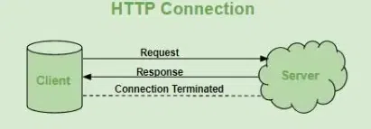
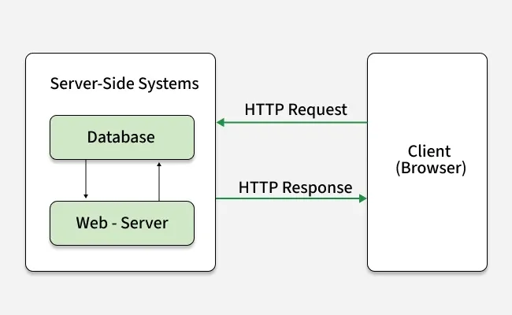
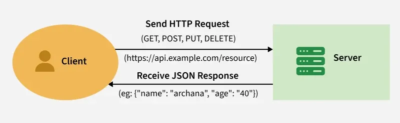

# Buổi 5 : SPRING BOOT CƠ BẢN
- [Buổi 5 : SPRING BOOT CƠ BẢN](#buổi-5--spring-boot-cơ-bản)
  - [HTTP là gì:](#http-là-gì)
    - [Các method trong HTTP](#các-method-trong-http)
    - [Response là gì, Request là gì ?](#response-là-gì-request-là-gì-)
  - [API là gì, RestAPI là gì?](#api-là-gì-restapi-là-gì)
    - [API](#api)
    - [Tại sao chúng ta cần API?](#tại-sao-chúng-ta-cần-api)
    - [API hoạt động như thế nào?](#api-hoạt-động-như-thế-nào)
    - [REST API:](#rest-api)
    - [Các phương thức HTTP phổ biến được sử dụng trong REST API](#các-phương-thức-http-phổ-biến-được-sử-dụng-trong-rest-api)
      - [1. Phương Thức GET](#1-phương-thức-get)
      - [2. Phương thức POST](#2-phương-thức-post)
      - [3. Phương thức PUT](#3-phương-thức-put)
      - [4. Phương thức PATCH](#4-phương-thức-patch)
      - [5. Phương pháp XÓA](#5-phương-pháp-xóa)
  - [Design Pattern: DI,IOC](#design-pattern-diioc)
    - [DI(Dependency Injection):](#didependency-injection)
    - [Inversion of Control (Đảo chiều sự điều khiển)](#inversion-of-control-đảo-chiều-sự-điều-khiển)

## HTTP là gì:
- HTTP(Hypertext Transfer Protocol) là giao thức cơ bản của Internet, cho phép truyền dữ liệu giữa máy khách và máy chủ. Đây là nền tảng của truyền thông dữ liệu cho World Wide Web. HTTP cung cấp một tiêu chuẩn giữa trình duyệt web và máy chủ web để thiết lập giao tiếp. Nó là một tập hợp các quy tắc để truyền dữ liệu từ máy tính này sang máy tính khác.



-  lưu ý dữ liệu văn bản, hình ảnh và các tệp đa phương tiện khác được chia sẻ trên World Wide Web. Bất cứ khi nào người dùng web mở trình duyệt web, họ gián tiếp sử dụng HTTP. Đây là một giao thức ứng dụng được sử dụng cho các hệ thống thông tin siêu phương tiện phân tán, cộng tác.

Các đặc trưng của HTTP(features):
+ **Stateless**(Không có trạng thái) : Mỗi yêu cầu đều độc lập và máy chủ không lưu giữ thông tin tương tác trước đó.

+ **Text-Based**(Dựa trên văn bản): Tin nhắn ở trạng thái văn bản thuần túy, dễ đọc và gỡ lỗi.

+ **Client-Server Model:**(Mô hình máy khách-máy chủ) Áp dụng kiến trúc máy khách-máy chủ để yêu cầu và phục vụ tài nguyên.

+ **Request-Response:** (yêu cầu-Phản hồi): hoạt động theo chu kỳ yêu cầu - phản hồi giữa máy khách và máy chủ.

+ Request Methods(Phương thức yêu cầu): hỗ trợ nhiều phương thức như GET, POST, PUT,DELETE cho các hành động các nhau trên tài nguyên.

### Các method trong HTTP
+ **GET**: Được sử dụng để truy xuất dữ liệu từ một tài nguyên được chỉ định. Phương thức này không có tác dụng phụ và thường được sử dụng để truy xuất trang web, hình ảnh,vv
+ **POST**: Dùng để gửi dữ liệu để một tài nguyên cụ thể xử lí. Phù hợp cho việc gửi biểu mẫu , tải tệp lên và tạo tài nguyên mới.
+ **PUT**: Được sử dụng để cập nhật hoặc tạo tài nguyên trên máy chủ. Lệnh này được thay thế toàn bộ tài nguyên bằng dữ liệu được cung cấp trong phần thân yêu cầu.
+ **PATCH**: Tương tự như PUT, nhưng được sử dụng để đổi một phần tài nguyên. Nó cập nhật các trường hợp cụ thể của tài nguyên thay vì thay thế toàn bộ tài nguyên.
+ **DELETE**: Được sử dụng để xóa toàn bộ một tài nguyên đã chỉ định khỏi máy chủ.
+ **HEAD**: tương tự  như GET nhưng chỉ truy xuất tiêu đề phản hồi, hữu ích để kiểm tra thuộc tính tài nguyên mà không cần chuyển toàn bộ nội dung.
+ **OPTIONS**: Được sử dụng để truy xuất các tùy chọn giao tiếp có sẵn cho một tài nguyên , bao gồm các phương thức và tiêu đề được hỗ trợ.
+ **TRACE**: Được sử dụng cho mục đích gỡ lỗi để phản hồi yêu cầu đã nhận cho máy khách, mặc dù nó hiếm khi được sử dụng do lo ngại về bảo mật.
+ **CONNECT**: Được sử dụng để thiết lập đường hầm đến cho máy chủ thông qua proxy HTTP , thường được sử dụng cho kết nối SSL/TLS
### Response là gì, Request là gì ?
HTTP là giao thức yêu cầu-phản hồi , nghĩa là với mỗi yêu cầu được gửi  bởi máy khách , máy chủ sẽ phản hồi bằng một phản hồi tương ứng . Luông cơ bản của một chu trình yêu cầu - phản hồi HTTP như sau:

- **Client sends an HTTP request**: Máy khách (thường là trình duyệt web) khởi tạo quy trình bằng cách gửi yêu cầu HTTP đến máy chủ. Yêu cầu này bao gồm phương thức yêu cầu(GET,POST,PUT,DELETE,...) URL đích, tiêu đề và nội dụng yêu cầu tùy chọn.
- **Server processes the request**: Máy chủ nhận yêu cầu và xử lí dựa trên phương thức và tài nguyên được yêu cầu. Việc này có thể bao gồm việc truy xuất dữ liệu từ cơ sở dữ liệu, thực thi các tập lệnh phía máy chủ hoặc thực hiện các thao tác khác.
- **Server sends an HTTP response**: Sau khi xử lý yêu cầu, máy chủ sẻ gửi phản hồi HTTP trở lại máy khách. Phản hồi bao gồm mã trạng thái(ví dụ: 200 ok,404 not found) , tiêu đề phản hồi và phần nội dung phản hồi tùy chọn chứa dữ liệu hoặc nội dung được yêu cầu.
- Client processes the response: Máy khách nhận được phản hồi từ máy chủ và xử lí tương ứng. Ví dụ: nếu phản hồi chứa một trang HTML, trình duyệt sẽ kết xuất và hiển thị trang đó. Nếu đó là hình ảnh hoặc tệp phương tiện khác, trình duyệt sẽ hiển thị hoặc xử lý phù hợp.
  


## API là gì, RestAPI là gì?

### API

+ API(Aplication Programmer Interface)  là một tập hợp các quy tắc cho phép các ứng dụng phần mềm khác nhau giao tiếp với nhau. Hãy coi nó như một cầu nối kết nối hai hệ thống—chẳng hạn như máy khách và máy chủ—và cho phép chúng hoạt động liền mạch cùng nhau.

+ Để hiểu rõ hơn, hãy tưởng tượng bạn đang ở một nhà hàng: nhân viên phục vụ (API) tiếp nhận đơn hàng của bạn (request), đưa cho đầu bếp (server), rồi mang món ăn đã chế biến (response) trở lại bàn của bạn. Tương tự, khi bạn tìm kiếm một khóa học trên một trang web, yêu cầu của bạn sẽ đi qua một API, sau đó API sẽ lấy dữ liệu từ cơ sở dữ liệu và gửi lại dưới dạng phản hồi.


### Tại sao chúng ta cần API?
+ API giúp các nhà phát triển tạo chương trình phần mềm dễ dàng hơn. Thay vì phải viết mã phức tạp từ đầu, họ có thể gọi các API đã cung cấp sẵn các chức năng cần thiết. Ví dụ: nếu nhà phát triển muốn hiển thị báo cáo thời tiết, họ có thể sử dụng API để lấy dữ liệu thay vì phải tự xây dựng toàn bộ hệ thống để thu thập dữ liệu thời tiết.

+ API cũng rất quan trọng trong việc xây dựng các trang web hiện đại, nơi diễn ra quá trình truyền dữ liệu lớn giữa máy khách (người dùng) và máy chủ.

### API hoạt động như thế nào?
API hoạt động theo quy trình từng bước đơn giản:

+ **Yêu cầu**: Máy khách (người dùng) gửi yêu cầu thông qua URI (Mã định danh tài nguyên thống nhất) của API.
+ **Xử lý**: API chuyển tiếp yêu cầu đến máy chủ.
+ **Phản hồi**: Máy chủ xử lý yêu cầu và gửi phản hồi trở lại API.
+ **Giao hàng**: API trả về phản hồi của máy chủ cho máy khách.

Hãy hình dung đây là kiến ​​trúc máy khách-máy chủ: máy khách gửi yêu cầu, máy chủ xử lý yêu cầu đó và API đóng vai trò là mối đe dọa messenger.curity. Để cung cấp thêm các lớp bảo mật cho dữ liệu, tiêu đề HTTP, tham số chuỗi truy vấn hoặc cookie được sử dụng.

### REST API:

REST API là viết tắt của Representational State Transfer API (API Chuyển giao Trạng thái Biểu diễn). Đây là một loại API (Giao diện Lập trình Ứng dụng) cho phép giao tiếp giữa các hệ thống khác nhau qua internet. REST API hoạt động bằng cách gửi yêu cầu và nhận phản hồi, thường ở định dạng JSON, giữa máy khách và máy chủ.



+ Một yêu cầu được gửi từ máy khách đến máy chủ thông qua URL web, sử dụng một trong các phương thức HTTP.
+ Sau đó, máy chủ sẽ phản hồi bằng tài nguyên được yêu cầu, có thể là HTML, XML, Hình ảnh hoặc JSON, trong đó JSON là định dạng được sử dụng phổ biến nhất cho các dịch vụ web hiện đại.
+ Các phương pháp này tương ứng với các hoạt động CRUD (Tạo, Đọc, Cập nhật, Xóa) để quản lý tài nguyên trên web.

**Lưu ý** => REST là một phong cách thiết kế kiến ​​trúc cho API, trong khi HTTP là giao thức truyền thông được sử dụng để truyền dữ liệu qua web. API REST sử dụng các phương thức HTTP để tương tác với tài nguyên, nhưng chúng không giống nhau. REST định nghĩa cách thức hoạt động của API, trong khi HTTP định nghĩa các quy tắc giao tiếp qua web. Chúng thường hoạt động cùng nhau, nhưng phục vụ các mục đích khác nhau.

### Các phương thức HTTP phổ biến được sử dụng trong REST API
Trong HTTP, có năm phương thức thường được sử dụng trong Kiến trúc dựa trên REST, đó là POST, GET, PUT, PATCH và DELETE. Chúng tương ứng với các thao tác tạo, đọc, cập nhật và xóa (hay CRUD). Ngoài ra còn có các phương thức khác ít được sử dụng hơn, chẳng hạn như OPTIONS và HEAD.

#### 1. Phương Thức GET
Phương thức HTTP GET được sử dụng để  đọc  (hoặc truy xuất) biểu diễn của một tài nguyên. Trong đường dẫn an toàn, GET trả về một biểu diễn dưới dạng XML hoặc JSON và mã phản hồi HTTP là 200 (OK). Trong trường hợp lỗi, nó thường trả về lỗi 404 (KHÔNG TÌM THẤY) hoặc 400 (YÊU CẦU KHÔNG HỢP LỆ).

```
GET/users/123
```
Yêu cầu này sẽ lấy dữ liệu cho người dùng có ID 123

#### 2. Phương thức POST
Phương thức POST thường được sử dụng để tạo tài nguyên mới. Nó thường được dùng để tạo tài nguyên cấp dưới liên quan đến tài nguyên cha. Sau khi tạo thành công, máy chủ sẽ trả về trạng thái HTTP 201 (Đã tạo) cùng với tiêu đề Location trỏ đến tài nguyên mới được tạo.
```
POST /users 
{ 
  "name": "Anjali", 
  "email": "gfg@example.com" 
}
```
yêu cầu này tạo ra một người dùng mới dữ liệu đã cho.

**LƯU Ý:** POST không an toàn và cũng không có tính bất biến.

#### 3. Phương thức PUT
PUT là một phương thức HTTP được sử dụng để cập nhật hoặc tạo tài nguyên trên máy chủ. Khi sử dụng PUT, toàn bộ tài nguyên được gửi trong phần thân yêu cầu và thay thế tài nguyên hiện tại tại URL được chỉ định. Nếu tài nguyên không tồn tại, PUT có thể tạo một tài nguyên mới.
```
PUT /users/123
{ 
  "name": "Anjali", 
  "email": "gfg@example.com"
}
```
Yêu cầu này cập nhật người dùng với ID 123 hoặc tạo người dùng mới nếu chưa có.

#### 4. Phương thức PATCH
PATCH là một phương thức HTTP được sử dụng để cập nhật một phần tài nguyên trên máy chủ. Không giống như PUT, PATCH chỉ yêu cầu các trường cần cập nhật được gửi trong phần thân yêu cầu. Nó sửa đổi các phần cụ thể của tài nguyên thay vì thay thế toàn bộ tài nguyên.
```
PATCH /users/123
{ 
  "email": "new.email@example.com" 
}
```
Yêu cầu này chỉ cập nhật email của người dùng có ID 123, giữ nguyên phần dữ liệu người dùng còn lại.

#### 5. Phương pháp XÓA
 Được sử dụng để  xóa  một tài nguyên được xác định bởi URI. Khi xóa thành công, trả về trạng thái HTTP 200 (OK) cùng với nội dung phản hồi.
 ```
 DELETE /users/123
```
Yêu cầu này sẽ xóa người dùng có ID 123.

**Tính bất biến:** Một phương thức HTTP bất biến là một phương thức HTTP có thể được gọi nhiều lần mà không cho kết quả khác nhau. Việc phương thức được gọi chỉ một lần hay mười lần đều không quan trọng. Kết quả phải giống nhau. Một lần nữa, điều này chỉ áp dụng cho kết quả, chứ không phải cho chính tài nguyên.


## Design Pattern: DI,IOC
### DI(Dependency Injection):
+ DI là một phương pháp lập trình, là một thiết kế để có được hiệu quả cao khi code. Nó sẽ giúp ích khá nhiều trong lập trình.

Dependency Injection là việc mà các Object nên phụ thuộc vào các Abstract Class và thể hiện chi tiết của nó sẽ được Inject và đối tượng trong lúc runtime.
### Inversion of Control (Đảo chiều sự điều khiển)
+ **Dependency Injection** giúp chúng ta dễ dàng mở rộng code và giảm sự phụ thuộc giữa các dependency với nhau. Tuy nhiên , lúc này , khi code bạn sẽ phải thêm nhiệm vụ Inject Dependency . thử tưởng tượng một class có hàng chục dependency thì chúng ta sẽ phải tự tay inject từng ý cái. Việc này lại dẫn tới khó khăn trong việc code , quản lí code và dependency

+ Bây giờ giả sử, chúng ta định nghĩa trước toàn bộ các dependency có trong Project, mô tả nó và tống nó vào 1 cái kho và giao cho một thằng tên là framework quản lý. Bất kỳ các Class nào khi khởi tạo, nó cần dependency gì, thì cái framework này sẽ tự tìm trong kho rồi inject vào đối tượng thay chúng ta. sẽ tiện hơn phải không?

+ Đối với Java thì có một số Framework hỗ trợ chúng ta Inversion of Control (IOC), trong đó nổi bật có:

  + **Spring framework**
  + **Google Guice**
+ **Spring framework** là một framework từ những ngày đầu, ra đời để thực hiện ý tưởng **Invention of Control(IOC)**, tuy nhiên theo thời gian thì Spring lớn mạnh và trở thành một hệ sinh thái rộng lớn phục vụ rất nhiều chức năng trên nền tảng IOC này.

LINK THAM KHẢO:
+ https://www.geeksforgeeks.org/blogs/backend-development/
+ https://viblo.asia/p/springgiai-thich-dependency-injection-di-va-ioc-bang-ngoc-trinh-naQZRW3Alvx