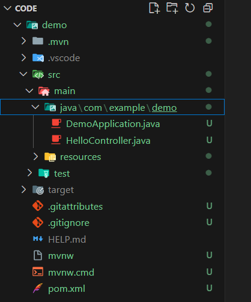
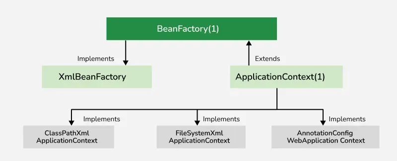

  - [SpringBoot Cơ bản:](#springboot-cơ-bản)
    - [Khởi tạo dự án cơ bản](#khởi-tạo-dự-án-springboot)
    - [Bean trong SpringBoot: Bean là gì, BeanFactory là gì, vòng đời của 1 Bean ở trong SpringBoot](#bean-trong-springboot-bean-là-gì-beanfactory-là-gì-vòng-đời-của-1-bean-ở-trong-springboot)
      - [Bean là gì](#bean-là-gì)
      - 
     

# SpringBoot Cơ bản:

## Khởi tạo dự án SpringBoot
- Khởi tạo dự án trên Visual Studio Code bạn cần cài đặt 2 extension, đó là:
- **Extension Pack for Java** (chứa Java Debugger, Maven, Language Support…)
- **Spring Initializr Java Support** (hỗ trợ tạo, chạy và gỡ lỗi Spring Boot)

**Bước 1:**

* Mở **Command Palette (Ctrl+Shift+P)** → gõ:

  ```
  Spring Initializr: Create a Maven Project
  ```
**Bước 2:**

* Chọn:

  * **Language:** Java
  * **Group Id:** ví dụ `com.example`
  * **Artifact Id:** ví dụ `demo`
  * **Packaging:** Jar
  * **Java version:** 17
  * Chọn dependencies: ví dụ `Spring Web`, `Spring Boot DevTools`, `Spring Data JPA`, v.v.
* VS Code sẽ tạo một project hoàn chỉnh.

Kết quả: bạn sẽ có 1 project với cấu trúc như ảnh:



## Bean trong SpringBoot: Bean là gì, BeanFactory là gì, vòng đời của 1 Bean ở trong SpringBoot


### Bean là gì?

- Bean trong StringBoot là gì:
- Trong documenttation của Springframework , thì bean được định nghĩa như sau:
    ```
    In Spring , the objects that from the backbone of your application and that art managed by the Spring Ioc container are called beans. A bean is an object that is instantiated , assembled , and otherwise managed by a Spring Ioc Container.
    ```
Nói một cách đơn giản , bean là những module chính của chương trình , được tạo ra và quản lí bởi Spring IoC container.

Các bean có thể phụ thuộc lẫn nhau , như ví dụ về Car, Engine và ChinaEngine từ đầu series tới giờ. Sự phụ thuộc này được mô tả cho IoC biết nhờ cơ chế Dependency Injection. 

Lúc này chỉ cần biết đơn giản nhất là dùng @Component lên class là class đó là một bean.

### BranFactory là gì:

## 1\.  BeanFactory (Container cơ bản)

  * Được định nghĩa trong gói `org.springframework.beans.factory`.
  * Là **Container cơ bản** cung cấp các chức năng cốt lõi và sử dụng **Khởi tạo Lười (Lazy Initialization)**.

###  Khai báo (Ví dụ Lịch sử):

```java
ClassPathResource resource = new ClassPathResource("beans.xml");
XmlBeanFactory factory = new XmlBeanFactory(resource);
```

> **Lưu ý:** `XmlBeanFactory` đã bị loại bỏ trong Spring 4.0. Interface `BeanFactory` vẫn còn, nhưng ít được sử dụng trực tiếp.

## 2\.  ApplicationContext (Container nâng cao)

  * Được định nghĩa trong gói `org.springframework.context`.
  * Là **Container nâng cao** mở rộng `BeanFactory` với các tính năng bổ sung như: **quốc tế hóa (i18n)**, **lan truyền sự kiện**, và **tự động xử lý hậu kỳ Bean (Bean Post-Processing)**( internationalization, event propagation, and automatic bean post-processing).

###  Khai báo:

```java
ApplicationContext context = new ClassPathXmlApplicationContext("applicationContext.xml");
```

-----

### Hệ thống phân cấp giao diện:
Dưới đây là hệ thống phân cấp của BeanFactory(I) và ApplicationContext(I) cùng một số lớp triển khai của chúng.



Giải thích một số chức năng

#### 1. **Bean Autowiring**
Autowiring cho phép Spring tự động giải quyết và đưa các bean cộng tác vào:
**BeanFactory**: Sử dụng cấu hình XML với thuộc tính autowire.
Ví dụ: 
```java
<bean id="welcomeBean" class="com.geeks.beans.WelcomeBean" autowire="byName"/>
```
**ApplicationContext**: Hỗ trợ các chú thích như @Autowired trên các thuộc tính, trình thiết lập hoặc trình xây dựng.
 
#### **2.Đăng ký BeanPostProcessors và BeanFactoryPostProcessors**
**BeanPostProcessors**: Được sử dụng để sửa đổi các thể hiện bean sau khi chúng được khởi tạo. Nó cho phép bạn thêm logic tùy chỉnh trước hoặc sau khi một bean được tạo hoàn chỉnh bằng cách triển khai giao diện BeanPostProcessor.

**BeanFactoryPostProcessor**s: Được sử dụng để sửa đổi định nghĩa bean (siêu dữ liệu) trước khi bean thực sự được tạo. Triển khai giao diện BeanFactoryPostProcessor để thay đổi cấu hình bean ở cấp độ container.


**Đăng ký trong BeanFactory**:
Khi sử dụng giao diện BeanFactory, nếu có bất kỳ bean nào triển khai giao diện BeanPostProcessor hoặc BeanFactoryPostProcessor, thì các bộ xử lý hậu bean phải được đăng ký rõ ràng theo cách thủ công.

Ví dụ:
```java
// create BeanFactory
ConfigurableBeanFactory factory = new ConfigurableBeanFactory(resource); 

// register needed BeanPostProcessors
HelloBeanPostProcessor bpp = new HelloBeanPostProcessor();
factory.addBeanPostProcessor(bpp);
```
**Đăng ký trong ApplicationContext:**
Giao diện ApplicationContext sẽ tự động phát hiện bất kỳ bean nào được triển khai vào nó đang triển khai giao diện BeanPostProcessor hoặc BeanFactoryPostProcessor và đăng ký chúng dưới dạng hậu xử lý, sau đó factory sẽ gọi chúng một cách thích hợp khi tạo bean. Vì vậy, việc sử dụng hậu xử lý bean factory trong ApplicationContext thuận tiện hơn nhiều so với trong BeanFactories thông thường.

#### 3. Tải/Khởi tạo các bean

**Ví dụ về BeanFactory**: Tạo các lớp và tệp XML bên dưới.

**WelcomeBean.java**: Một lớp Java bean để định nghĩa các thuộc tính, phương thức getter/setter của các thuộc tính.

```java
public class WelcomeBean {

    private String name;

    public String getName() {
        return name;
    }

    public void setName(String name) {
        this.name = name;
    }

    public String welcomeMsg() {
        return "Welcome " + name;
    }

    public void initializeBean() {
        System.out.println("Welcome Bean is initialized!!");
    }

    public void destroyBean() {
        System.out.println("Welcome Bean is destroyed!!");
    }
}
```
beans.xml: Tệp XML để cấu hình các bean.
```java

```

Không demo được :(

#### 4.🆚 So sánh Chức năng Chi tiết

| Tính năng | BeanFactory | ApplicationContext |
| :--- | :--- | :--- |
| **Định nghĩa** | Container cơ bản, cung cấp chức năng quản lý Bean cốt lõi. | Container nâng cao, mở rộng `BeanFactory` với nhiều tính năng bổ sung. |
| **Sử dụng** | Phù hợp cho các ứng dụng **standalone** đơn giản (yêu cầu ít bộ nhớ). | Phù hợp cho các ứng dụng **Doanh nghiệp (Enterprise)**, ứng dụng web, tích hợp AOP, ORM. |
| **Khởi tạo Bean** | Tạo đối tượng Bean **theo yêu cầu (on demand)**, sử dụng **Khởi tạo Lười (Lazy Initialization)**. | **Tải và tạo tất cả các Bean** ngay khi khởi động (startup), sử dụng **Khởi tạo Sớm (Eager Initialization)**. |
| **Bean Scopes** | Chỉ hỗ trợ **Singleton** và **Prototype**. | Hỗ trợ **tất cả các loại scope** (Singleton, Prototype, Request, Session, v.v.). |
| **Hỗ trợ Annotation** | **Không** hỗ trợ Annotation; yêu cầu cấu hình trong XML. | Hỗ trợ cấu hình dựa trên **Annotation** (ví dụ: `@Autowired`). |
| **Internationalization (i18n)** | **Không** cung cấp chức năng quốc tế hóa (`MessageSource`). | **Cung cấp** chức năng quốc tế hóa (mở rộng `MessageSource` interface). |
| **Xử lý Sự kiện** | **Không** hỗ trợ xuất bản sự kiện. | **Hỗ trợ** xử lý sự kiện thông qua `ApplicationEvent` và `ApplicationListener`. |
| **Bean Post-Processing**| Yêu cầu **đăng ký thủ công** `BeanPostProcessor` và `BeanFactoryPostProcessor`. | **Tự động phát hiện** và đăng ký `BeanPostProcessor` và `BeanFactoryPostProcessor` khi khởi động. |
| **Autowiring** | Sử dụng cấu hình XML với thuộc tính `autowire`. | Hỗ trợ **Annotation** (`@Autowired`) trên thuộc tính, setter, hoặc constructor. |
| **Sử dụng Tài nguyên** | Cung cấp các tính năng cơ bản, yêu cầu **ít bộ nhớ** hơn. | Cung cấp các tính năng cơ bản và nâng cao, yêu cầu **nhiều bộ nhớ** hơn. |

-----

### IV. Vòng đời của Bean:
Vòng đời của bean bao gồm các bước sau:

+ Bean Definition : khởi tạo bean thông qua sử dụng Annotation hoặc XML

+ Bean Instantiation : Spring khởi tạo các đối tượng Bean giống như khởi tạo đối tượng Java thông thường và đưa nó vào ApplicationContext

+ Populating Bean properties : Spring thực hiện scan các bean thực thi các Aware interfaces và thực hiện set các giá vào các property như id, scope và giá trị mặc định như khai báo của bean đấy

+ Pre-Initialization : Các phương thức postProcessBeforeInitialization() bắt đầu thực thi và @PostConstruct thực thi sau ngay nó

+ AfterPropertiesSet : Spring thực thi các phương thức afterPropertiesSet() của beans mà có implement InitializingBean

+ Custom Initialization : Spring kích hoạt các method khởi tạo với các thuộc tính được define ở trong initMethod trong @Bean annotations

+ Post-initialization : BeanPostProcessors của Spring hoạt động lần thứ 2. Lần này nó kích hoạt các phương thức postProcessAfterInitialization()

+ Ready : các Bean đã được khởi tạo và inject vào trong các dependencies

+ Pre-Destroy : Spring kích hoạt @PreDestroy annotated methods ở bước này

+ Destroy : Spring thực thi the destroy() methods

+ Custom Destruction : chúc ta có thể tuỳ chỉnh các thời điểm huỷ bằng thuộc tính destroyMethod ở trong @Bean annotation và Spring sẽ chạy nó trong giai đoạn cuối.

## String MVC : @Controller, Thymeleaf
*  Spring được sử dụng rộng rãi để tạo các ứng dụng có khả năng mở rộng. Đối với các ứng dụng web, Spring cung cấp khung công tác Spring MVC, một module được sử dụng rộng rãi của Spring, được dùng để tạo các ứng dụng web có khả năng mở rộng. Khung công tác Spring MVC cho phép tách biệt các module: Model View, Controller, và xử lý liền mạch việc tích hợp ứng dụng. Điều này cho phép nhà phát triển tạo các ứng dụng phức tạp ngay cả khi sử dụng các lớp Java thuần túy. Đối tượng Model có thể được truyền giữa View và Controller bằng cách sử dụng bản đồ

*  **Mô hình** - Mô hình có thể là một đối tượng hoặc tập hợp các đối tượng về cơ bản chứa dữ liệu của ứng dụng.

* **View** - View được sử dụng để hiển thị thông tin cho người dùng theo một định dạng cụ thể. Spring hỗ trợ nhiều công nghệ như freemarker , velocity và thymeleaf .

* **Bộ điều khiển** - Chứa phần logic của ứng dụng. Chú thích @Controller được sử dụng để đánh dấu lớp đó là bộ điều khiển.

* **Front Controller** - Bộ điều khiển này vẫn chịu trách nhiệm quản lý luồng của ứng dụng web. Dispatcher Servlet hoạt động như một front controller trong Spring MVC.

**Cụ thể hơn về Controller và Thymeleaf**


---


**Controller** là thành phần trung tâm trong mô hình **MVC (Model - View - Controller)**.
Nó **nhận request từ client (trình duyệt)**, xử lý logic (hoặc gọi service/model để xử lý), rồi **trả dữ liệu về View (HTML)**.


* **@Controller**: đánh dấu class là Controller để Spring quản lý.
* **@GetMapping**, **@PostMapping**: định nghĩa đường dẫn (URL) mà Controller sẽ nhận.
* **Model**: dùng để **truyền dữ liệu** từ Controller sang View.

---

## Ví dụ 1: Controller đơn giản

```java
package com.example.demo.controller;

import org.springframework.stereotype.Controller;
import org.springframework.ui.Model;
import org.springframework.web.bind.annotation.GetMapping;

@Controller
public class HelloController {

    @GetMapping("/hello")
    public String sayHello(Model model) {
        model.addAttribute("name", "Toàn Nguyễn");
        return "hello"; // Trả về hello.html
    }
}
```

**hello.html (Thymeleaf View):**

```html
<!DOCTYPE html>
<html xmlns:th="http://www.thymeleaf.org">
<head>
    <title>Xin chào</title>
</head>
<body>
    <h2 th:text="'Xin chào, ' + ${name} + '!'"></h2>
</body>
</html>
```


---

# 2. Thymeleaf là gì?

**Thymeleaf** là một **template engine** cho Java — giúp bạn viết HTML **có thể hiển thị động dữ liệu từ server** (Spring).

Nó thay thế các phần trong HTML bằng dữ liệu thật.
Ví dụ: `${name}` lấy giá trị từ `model.addAttribute("name", "Toàn")`.

---

##  Một số cú pháp cơ bản trong Thymeleaf

| Cú pháp               | Mục đích          | Ví dụ                                                  |
| --------------------- | ----------------- | ------------------------------------------------------ |
| `th:text`             | Hiển thị dữ liệu  | `<p th:text="${user}"></p>`                            |
| `th:each`             | Lặp qua danh sách | `<li th:each="item : ${list}" th:text="${item}"></li>` |
| `th:if` / `th:unless` | Điều kiện         | `<p th:if="${age > 18}">Người lớn</p>`                 |
| `th:href`             | Gắn link động     | `<a th:href="@{/home}">Trang chủ</a>`                  |
| `th:action`           | Đặt URL của form  | `<form th:action="@{/save}" method="post">`            |

---

# 3. Ví dụ: Truyền danh sách đối tượng sang View

###  Controller:

```java
package com.example.demo.controller;

import org.springframework.stereotype.Controller;
import org.springframework.ui.Model;
import org.springframework.web.bind.annotation.GetMapping;

import java.util.Arrays;
import java.util.List;

@Controller
public class ProductController {

    @GetMapping("/products")
    public String showProducts(Model model) {
        List<String> products = Arrays.asList("Laptop", "Điện thoại", "Tai nghe");
        model.addAttribute("products", products);
        return "product-list";
    }
}
```

###  View (product-list.html)

```html
<!DOCTYPE html>
<html xmlns:th="http://www.thymeleaf.org">
<head>
    <title>Danh sách sản phẩm</title>
</head>
<body>
    <h2>Danh sách sản phẩm</h2>
    <ul>
        <li th:each="item : ${products}" th:text="${item}"></li>
    </ul>
</body>
</html>
```

Kết quả hiển thị:

```
Danh sách sản phẩm
- Laptop
- Điện thoại
- Tai nghe
```

---

# 4. Ví dụ nâng cao: Form gửi dữ liệu lên Controller

###  View (form.html)

```html
<!DOCTYPE html>
<html xmlns:th="http://www.thymeleaf.org">
<head><title>Form người dùng</title></head>
<body>
    <h2>Nhập tên của bạn</h2>
    <form th:action="@{/submit}" method="post">
        <input type="text" name="username" placeholder="Nhập tên của bạn" />
        <button type="submit">Gửi</button>
    </form>
</body>
</html>
```

###  Controller:

```java
import org.springframework.stereotype.Controller;
import org.springframework.ui.Model;
import org.springframework.web.bind.annotation.PostMapping;
import org.springframework.web.bind.annotation.RequestParam;

@Controller
public class FormController {

    @PostMapping("/submit")
    public String handleSubmit(@RequestParam("username") String username, Model model) {
        model.addAttribute("username", username);
        return "result";
    }
}
```

###  View (result.html)

```html
<!DOCTYPE html>
<html xmlns:th="http://www.thymeleaf.org">
<head><title>Kết quả</title></head>
<body>
    <h2 th:text="'Xin chào, ' + ${username} + '!'"></h2>
</body>
</html>
```

 Khi nhập tên “Toàn” → hiển thị:
**"Xin chào, Toàn!"**

---

#  5. Mối quan hệ giữa Controller và Thymeleaf

| Thành phần           | Vai trò                        | Ví dụ                               |
| -------------------- | ------------------------------ | ----------------------------------- |
| **Controller**       | Xử lý logic, tạo dữ liệu       | `model.addAttribute("user", user);` |
| **Model**            | Cầu nối giữa Controller & View | Truyền dữ liệu qua thuộc tính       |
| **Thymeleaf (View)** | Hiển thị dữ liệu lên giao diện | `<p th:text="${user.name}"></p>`    |

---

#  Tóm lại

* **Controller**: Xử lý request, trả về dữ liệu.
* **Thymeleaf**: Hiển thị dữ liệu trên giao diện HTML.
* **Model**: Là cầu nối giữa Controller ↔ View.

Cấu trúc thường thấy:

```
@Controller
@GetMapping("/path")
public String handler(Model model) {
   model.addAttribute("key", value);
   return "viewName";
}
```

→ File HTML trong `/templates/viewName.html` dùng `${key}` để hiển thị dữ liệu.

---s

## 1 số Annotation trong SpingBoot: 
### 1. @SpringBootApplication Annotation
- Chú thích này được sử dụng để đánh dấu lớp chính của ứng dụng SpringBoot
- Nó đóng gói các chú thích  @SpringBootConfiguration, @EnableAutoConfiguration và @ComponentScan cùng với các thuộc tính mặc định của chúng.


Ví dụ :

```java
@StringBootApplication

// Class
public class DemoApplication {

    // Main driver method
    public static void main(String[] args)
    {
        SpringApplication.run(DemoApplication.class, args);
    }
}

```


### 2.Chú thích @SpringBootConfiguration
+ Chỉ ra rằng một lớp cung cấp cấu hình cho ứng dụng Spring Boot.
+ Giải pháp thay thế cho @Configuration của Spring.
+ Được tự động bao gồm trong @SpringBootApplication.

Ví dụ:
```java
@SpringBootConfiguration
public class Application {

    public static void main(String[] args) {
        SpringApplication.run(Application.class, args);
    }

    @Bean
    public StudentService studentService() {
        return new StudentServiceImpl();
    }
}
```

### 3. Chú thích @EnableAutoConfiguration
+ Chú thích này tự động cấu hình các bean có trong classpath.
+ Cho phép cơ chế tự động cấu hình của Spring Boot.

Ví dụ:
```java
@Configuration
@EnableAutoConfiguration
public class Application {

    public static void main(String[] args) {
        SpringApplication.run(Application.class, args);
    }
}
```

### Chú thích @ComponentScan
+ Cho Spring biết nơi tìm kiếm các thành phần (@Controller, @Service, @Repository, v.v.).
+ Thường được sử dụng với @Configuration.

```java
@Configuration
@ComponentScan

// Main class
public class Application {

    // Main driver method
    public static void main(String[] args)
    {
        SpringApplication.run(Application.class, args);
    }
}
```
### 5. Chú thích @ConditionalOnClass và Chú thích @ConditionalOnMissingClass
+ Chú thích @ConditionalOnClass được sử dụng để đánh dấu bean cấu hình tự động nếu lớp trong đối số của chú thích có/không có.

```java
@Configuration
@ConditionalOnClass(MongoDBService.class)

class MongoDBConfiguration {
    // Insert code here
}
```
### 6. Chú thích @ConditionalOnBean và Chú thích @ConditionalOnMissingBean
+ Những chú thích này được sử dụng để cho phép đưa một bean vào dựa trên sự có mặt hoặc vắng mặt của các bean cụ thể.
```java
@Bean
@ConditionalOnMissingBean(type = "JpaTransactionManager")

JpaTransactionManager jpaTransactionManager(
    EntityManagerFactory entityManagerFactory)
{
    // Insert code here
}
```

## Chú thích Xử lý yêu cầu và Bộ điều khiển:
**Một số chú thích quan trọng thuộc danh mục này là:**

+ @Bộ điều khiển
+ @RestController
+ @RequestMapping
+ @RequestParam
+ @PathVariable
+ @RequestBody
+ @ResponseBody
+ @ModelAttribute


**1. Chú thích @Controller**

+ Chú thích này cung cấp các tính năng của Spring MVC .
Nó được sử dụng để tạo các lớp Controller và đồng thời xử lý các yêu cầu HTTP.
+ Nói chung, dụng chú thích @Controller với chú thích @RequestMapping để ánh xạ các yêu cầu HTTP với các phương thức bên trong lớp bộ điều khiển.

**2. Chú thích @RestController**

+ Chú thích này được sử dụng để xử lý REST API và cũng được sử dụng để tạo các dịch vụ web RESTful bằng Spring MVC.
+ Nó đóng gói chú thích @Controller và chú thích @ResponseBody với các thuộc tính mặc định của chúng.
+ @RestController = @Controller + @ResponseBody

**3. Chú thích @RequestMapping**

+ Ánh xạ các yêu cầu HTTP tới các phương thức xử lý.
+ Hỗ trợ GET, POST, PUT, DELETE, v.v.

Ví dụ:

```java
@RestController
public class Geeks{
    @RequestMapping(value = "/welcome", method = RequestMethod.GET)
    public String welcome() {
        return "Welcome to Spring Boot!";
    }
}
```
Để xử lý các yêu cầu HTTP cụ thể, chúng ta có thể sử dụng

+ @GetMapping
+ @PutMapping
+ @PostMapping
+ @PatchMapping
+ @DeleteMapping

---
 LƯU Ý: Chúng ta có thể sử dụng thủ công các chú thích GET, POST, PUT và DELETE cùng với đường dẫn cũng như chúng ta có thể sử dụng chú thích @RequestMapping cùng với phương thức cho tất cả các yêu cầu xử lý ở trên
---
**4. Chú thích @RequestParam**
+ Chú thích @RequestParam được sử dụng để đọc dữ liệu biểu mẫu và liên kết tham số yêu cầu web với phương thức điều khiển cụ thể.
Ví dụ:
```java
@RestController
public class MyController{
  
  @GetMapping("/authors")
  public String getAuthors(@RequestParam(name="authorName") String name){
    //insert code here
  }
}
```
**5. Chú thích @PathVariable**
Chú thích này được sử dụng để trích xuất dữ liệu từ đường dẫn URI. Nó liên kết biến đường dẫn mẫu URL với biến phương thức.

Ví dụ:
```java
@RestController
public class MyController{
  
    @GetMapping("/author/{authorName}")
    public String getAuthorName(@PathVariable(name = "authorName") String name){
      //insert your code here
    }
}
```

**6. Chú thích @RequestBody**
Chú thích này được sử dụng để chuyển đổi các yêu cầu HTTP từ định dạng JSON đến thành các đối tượng miền trực tiếp từ phần thân yêu cầu. Tại đây, tham số phương thức được liên kết với phần thân của yêu cầu HTTP.

Ví dụ:
```java
@RestController
public class MyController{
  
  @GetMapping("/author")
  public void printAuthor(@RequestBody Author author){
    //insert code here
  }
}
```

**7. Chú thích @ResponseBody**
Chú thích này được sử dụng để chuyển đổi đối tượng miền thành yêu cầu HTTP dưới dạng JSON hoặc bất kỳ văn bản nào khác. Ở đây, kiểu trả về của phương thức được liên kết với nội dung phản hồi HTTP.

Ví dụ:
```java
@Controller
public class MyController{
  
  public @ResponseBody Author getAuthor(){
    Author author = new Author();
    author.setName("GFG");
    author.setAge(20);
    return author;
  }
}
```

## Lombok: @Getter, @Setter, @ToString, @Data, @Builder, @Constructior

Các annotations của **Lombok** như `@Getter`, `@Setter`, `@ToString`, `@Data`, `@Builder`, và `@Constructor` (thường được thay bằng `@NoArgsConstructor`, `@AllArgsConstructor`, `@RequiredArgsConstructor`) là các công cụ trong **Java** giúp **giảm thiểu code lặp lại (boilerplate code)**, đặc biệt hữu ích trong các ứng dụng **Spring** (như tạo các **POJO** - Plain Old Java Objects, **Entity**, **DTO** - Data Transfer Objects).

Về cơ bản, Lombok tự động sinh ra code Java theo mẫu trong quá trình biên dịch (compile time), giúp code của bạn ngắn gọn và dễ đọc hơn.

-----

##  Chức Năng Của Từng Annotation Lombok

| Annotation | Chức năng | Áp dụng |
| :--- | :--- | :--- |
| **`@Getter`** | Tự động sinh ra phương thức **getter** cho các trường (field) được chú thích, hoặc cho **tất cả** các trường nếu chú thích trên lớp. | Lớp hoặc Trường |
| **`@Setter`** | Tự động sinh ra phương thức **setter** cho các trường được chú thích, hoặc cho **tất cả** các trường nếu chú thích trên lớp (trừ các trường `final`). | Lớp hoặc Trường |
| **`@ToString`** | Tự động sinh ra phương thức **`toString()`** bao gồm tên và giá trị của các trường trong lớp, hữu ích cho việc ghi nhật ký (logging) và gỡ lỗi (debugging). | Lớp |
| **`@Data`** | Là một annotation tổng hợp, bao gồm **`@Getter`** (cho tất cả các trường), **`@Setter`** (cho tất cả các trường không `final`), **`@ToString`**, **`@EqualsAndHashCode`**, và **`@RequiredArgsConstructor`** (tạo constructor cho các trường `final` hoặc được đánh dấu `@NonNull`). | Lớp |
| **`@Builder`** | Áp dụng mẫu thiết kế **Builder** (Builder pattern) cho lớp, cho phép tạo đối tượng một cách linh hoạt và dễ đọc hơn (đặc biệt khi có nhiều tham số). | Lớp hoặc Phương thức |
| **`@NoArgsConstructor`** | Tự động sinh ra **constructor không tham số**. | Lớp |
| **`@AllArgsConstructor`** | Tự động sinh ra **constructor với tất cả các tham số** (tất cả các trường trong lớp). | Lớp |
| **`@RequiredArgsConstructor`** | Tự động sinh ra **constructor với tham số cho các trường `final`** và các trường được đánh dấu `@NonNull`. | Lớp |

-----

## Log trong SpringBoot 


Việc ghi nhật ký trong Spring Boot đóng vai trò quan trọng trong các ứng dụng Spring Boot để ghi lại thông tin, hành động và sự kiện trong ứng dụng. Nó cũng được sử dụng để theo dõi hiệu suất của ứng dụng, hiểu hành vi của ứng dụng và nhận biết các vấn đề trong ứng dụng. Spring Boot cung cấp khả năng ghi nhật ký linh hoạt bằng cách cung cấp nhiều khung ghi nhật ký khác nhau, đồng thời cung cấp các cách để quản lý và cấu hình nhật ký.

**Tại sao nên sử dụng Spring Boot - Ghi nhật ký?**

Một cơ sở hạ tầng ghi nhật ký tốt là điều cần thiết cho bất kỳ dự án phần mềm nào vì nó không chỉ giúp hiểu rõ những gì đang diễn ra với ứng dụng mà còn theo dõi bất kỳ sự cố hoặc lỗi bất thường nào hiện diện trong dự án. Bài viết này đề cập đến một số cách bật ghi nhật ký trong dự án Spring Boot thông qua các cấu hình đơn giản và dễ dàng. Trước tiên, hãy cùng thực hiện thiết lập ban đầu để tìm hiểu sâu hơn về từng tùy chọn.

Trong Spring Boot, **Log4j** là một trong những thư viện logging phổ biến, còn **`@Slf4j`** là một annotation của **Lombok** giúp đơn giản hóa việc sử dụng logging trong code.

Dưới đây là chi tiết về cả hai:

-----

## 1\.  Log4j trong Spring Boot

**Log4j** (hiện tại là **Log4j 2**) là một framework logging mã nguồn mở, mạnh mẽ và linh hoạt dành cho Java. Mặc dù **Spring Boot Starter** mặc định sử dụng **Logback** (thư viện logging được cải tiến và kế thừa từ Log4j 1.x) thông qua **SLF4J** (Simple Logging Facade for Java), bạn hoàn toàn có thể cấu hình để sử dụng Log4j 2.

### Chức năng và Vai trò:

  * **Ghi nhật ký (Logging):** Log4j cho phép ứng dụng ghi lại các sự kiện quan trọng (như thông báo lỗi, cảnh báo, thông tin hoạt động...) vào nhiều nơi khác nhau (console, file, database...).
  * **Các cấp độ Log (Log Levels):** Log4j định nghĩa các cấp độ log để kiểm soát lượng thông tin được ghi ra, bao gồm:
      * **`FATAL`** (Nguy hiểm)
      * **`ERROR`** (Lỗi)
      * **`WARN`** (Cảnh báo)
      * **`INFO`** (Thông tin)
      * **`DEBUG`** (Gỡ lỗi)
      * **`TRACE`** (Truy vết chi tiết nhất)
  * **Cấu hình Linh hoạt:** Cho phép bạn tùy chỉnh định dạng output, nơi lưu trữ log (**Appenders**), và cách các gói (packages) khác nhau được xử lý (**Loggers**).

### Tại sao lại nhắc đến trong Spring Boot?

Mặc dù Logback là mặc định, Log4j 2 vẫn là một lựa chọn phổ biến vì **hiệu suất cao** và các **tính năng nâng cao** như cấu hình không đồng bộ (asynchronous logging) và khả năng xử lý lượng log lớn. Bạn có thể dễ dàng chuyển sang sử dụng Log4j 2 bằng cách loại bỏ `spring-boot-starter-logging` mặc định và thêm `spring-boot-starter-log4j2` vào tệp `pom.xml` (Maven) hoặc `build.gradle` (Gradle).

-----

## 2\.  Annotation `@Slf4j`

**`@Slf4j`** là một annotation của thư viện **Lombok** giúp bạn dễ dàng tạo một logger instance trong lớp Java.

### Chức năng:

  * Khi bạn đặt `@Slf4j` trên một lớp, **Lombok** sẽ tự động sinh ra đoạn code sau trong quá trình biên dịch:
    ```java
    private static final org.slf4j.Logger log = org.slf4j.LoggerFactory.getLogger(YourClassName.class);
    ```
  * Nói cách khác, nó tự động tạo một trường **`log`** tĩnh, cuối cùng (static final) để bạn có thể sử dụng ngay lập tức mà không cần phải tự khai báo thủ công.

### Lợi ích:

  * **Giảm Code Lặp lại (Boilerplate Code):** Bạn không cần phải viết dòng khai báo logger dài dòng và lặp lại cho mỗi lớp.
  * **Sử dụng SLF4J:** Nó luôn tạo logger dựa trên **SLF4J**, đảm bảo rằng code logging của bạn độc lập với framework logging thực tế đang được sử dụng (có thể là Logback, Log4j 2, hay JUL - Java Util Logging). Điều này rất quan trọng trong Spring Boot vì nó giúp bạn dễ dàng chuyển đổi giữa các framework logging.

### Ví dụ sử dụng:

**Trước khi dùng `@Slf4j` (cần khai báo thủ công):**

```java
import org.slf4j.Logger;
import org.slf4j.LoggerFactory;

public class UserService {
    private static final Logger log = LoggerFactory.getLogger(UserService.class);

    public void doSomething() {
        log.info("Bắt đầu xử lý...");
    }
}
```

**Sau khi dùng `@Slf4j` (code gọn gàng hơn):**

```java
import lombok.extern.slf4j.Slf4j;

@Slf4j // Lombok tự sinh ra trường 'log'
public class UserService {

    public void doSomething() {
        log.info("Bắt đầu xử lý..."); // Sử dụng trực tiếp biến 'log'
    }
}
```