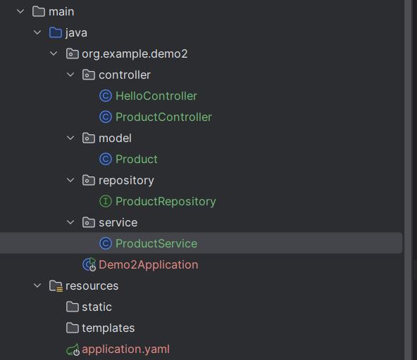
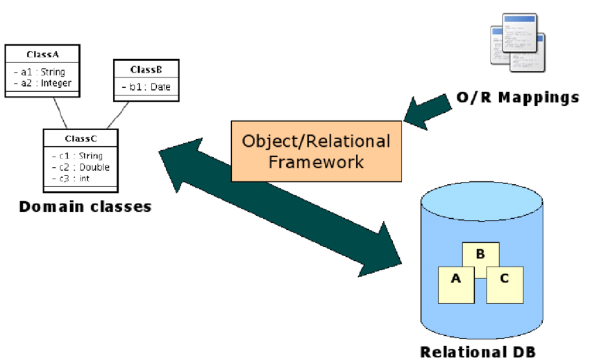
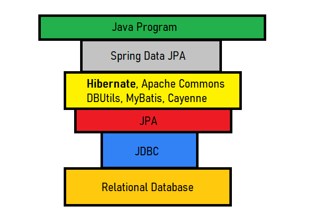
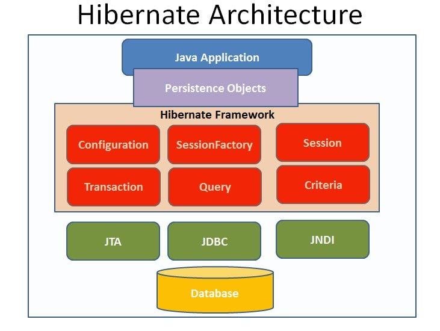
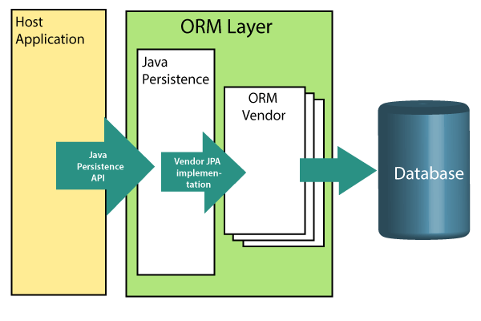
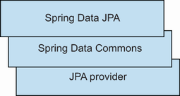
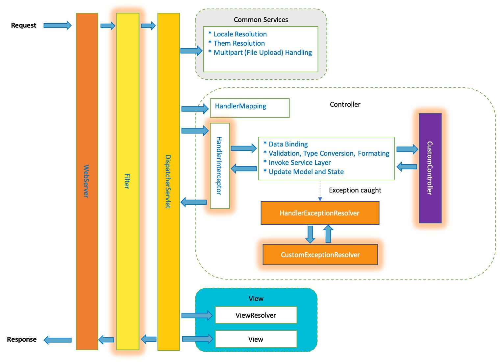

# CRUD Cơ Bản(SPRING BOOT CƠ BẢN)
## Triển khai RestfullAPI trong Spring Boot

### Cấu trúc cơ bản của một project RestfullAPI



### 1. Cài đặt thư viện:


Cấu trúc cơ bản của file application.yaml:
```yaml
spring:
  application:
    name: SPRING-BOOT_SHOP
  datasource:
    driver-class-name: com.mysql.cj.jdbc.Driver
    url: jdbc:mysql://localhost:3306/springboot_Toan
    username: root
    password: 27102005Az
```
cài đặt thư viện trong file pom.xml
```xml
<dependencies>
    <dependency>
        <groupId>org.springframework.boot</groupId>
        <artifactId>spring-boot-starter-web</artifactId>
    </dependency>

    <dependency>
        <groupId>org.springframework.boot</groupId>
        <artifactId>spring-boot-starter-data-jpa</artifactId>
    </dependency>
    
    <dependency>
        <groupId>com.mysql</groupId>
        <artifactId>mysql-connector-j</artifactId>
        <scope>runtime</scope>
    </dependency>

    <dependency>
        <groupId>org.springframework.boot</groupId>
        <artifactId>spring-boot-starter-test</artifactId>
        <scope>test</scope>
    </dependency>
</dependencies>
```
### Các thành phần chính trong Spring Boot RESTful API
Khi xây dựng một RESTful API với Spring Boot, có một số thành phần chính cần được triển khai để đảm bảo hệ thống hoạt động hiệu quả và dễ bảo trì. Dưới đây là các thành phần chính trong một ứng dụng Spring Boot RESTful API:

+ Model: Đây là các lớp đại diện cho dữ liệu trong ứng dụng. Các model thường được ánh xạ tới các bảng trong cơ sở dữ liệu và sử dụng các annotation như @Entity, @Table để xác định các thuộc tính và quan hệ.
```java
package org.example.demo2.model;

import jakarta.persistence.*;

import java.math.BigDecimal;

@Entity
@Table(name = "product")
public class Product {
    @Id
    @GeneratedValue(strategy = GenerationType.IDENTITY)
    private Long id;
    private String name;
    private String description;
    private BigDecimal price;

    public Product() {
    }

    public Product(Long id, String name, String description, BigDecimal price) {
        this.id = id;
        this.name = name;
        this.description = description;
        this.price = price;
    }

    public Long getId() {
        return id;
    }

    public void setId(Long id) {
        this.id = id;
    }

    public String getName() {
        return name;
    }

    public void setName(String name) {
        this.name = name;
    }

    public String getDescription() {
        return description;
    }

    public void setDescription(String description) {
        this.description = description;
    }

    public BigDecimal getPrice() {
        return price;
    }

    public void setPrice(BigDecimal price) {
        this.price = price;
    }
}
```

+ Repository: Đây là các lớp hoặc interface chịu trách nhiệm giao tiếp với cơ sở dữ liệu. Spring Data JPA cung cấp các repository tiêu chuẩn với các phương thức CRUD cơ bản, giúp giảm thiểu mã nguồn cần viết.
```java
package org.example.demo2.repository;

import org.example.demo2.model.Product;
import org.springframework.data.jpa.repository.JpaRepository;
import org.springframework.stereotype.Repository;

@Repository
public interface ProductRepository extends JpaRepository<Product,Long> {

}
```

+ Service: Các lớp service chứa logic nghiệp vụ của ứng dụng. Service quản lý việc xử lý dữ liệu, gọi repository để truy xuất hoặc lưu trữ dữ liệu, và có thể bao gồm các thao tác xử lý phức tạp.
```java
package org.example.demo2.service;


import org.example.demo2.model.Product;
import org.example.demo2.repository.ProductRepository;
import org.springframework.beans.factory.annotation.Autowired;
import org.springframework.stereotype.Service;

@Service
public class ProductService {


    private final ProductRepository productRepository;
    public ProductService(ProductRepository productRepository) {
        this.productRepository = productRepository;
    }
    public Long createProduct(Product product){
        productRepository.save(product);
        return product.getId();
    }
}
```
+ Controller: Các lớp controller xử lý các yêu cầu HTTP và trả về các phản hồi tương ứng. Controller sử dụng các annotation như @RestController, @RequestMapping, @GetMapping, @PostMapping để định tuyến các yêu cầu đến các phương thức phù hợp.

```java
package org.example.demo2.controller;

import org.example.demo2.model.Product;
import org.example.demo2.service.ProductService;
import org.springframework.web.bind.annotation.PostMapping;
import org.springframework.web.bind.annotation.RequestBody;
import org.springframework.web.bind.annotation.RestController;

@RestController
public class ProductController {
    private final ProductService productService;
    public ProductController(ProductService productService) {
        this.productService = productService;
    }
    @PostMapping("/products")
    public Long create(@RequestBody Product product){
        return productService.createProduct(product);
    }
}
```

## JPA là gì? Hibernate là gì?
### Sơ lược định nghĩa JPA
+ JPA, hay còn được gọi là **Java Persistence API**. Sau này được đổi tên thành **Jakarta Persistence API**
+ JPA giải quyết các vấn đề trong quản lý quan hệ giữa các thực thể, giúp chúng ta map những object Java (POJO – Plain Old Java OBject) thành những bảng trong database, đây là persistence frameworks được sử dụng nhiều nhất trong Java
+ Để hiểu sâu thêm, hãy đi thêm vào 1 số định nghĩa liên quan
### Persistence là gì?

+ ava Persistence API, Java là tên ngôn ngữ, API ám chỉ rằng đây là một framework cung cấp các api, các logic mà ta dễ dàng sử dụng lại giúp tăng tốc độ phát triển ứng dụng
+ Vậy Persistence là gì?
+ Hầu hết toàn bộ các ứng dụng yêu cầu ta cần có persistent data (dữ liệu lâu dài). Persistence là một trong những concept nền tảng trong công nghệ phần mềm. Gần như toàn bộ hệ thống thông tin đều cần lưu trữ những dữ liệu nào đó cho hệ thống. Object persistence nghĩa là các thực thể có thể “sống lâu” hơn các chương trình, có thể lưu trữ trong các nơi quản lý dữ liệu và có thể khởi tạo lại trong chương trình vào thời điểm nào đó.
+ Ví dụ đơn giản, trong một web mua bán thương mại điện tử chẳng hạn, dữ liệu trong hệ thống thường là các thông tin về sản phẩm, giá bán, nơi bán, … những dữ liệu này luôn được lưu trữ, kể cả web có thể là bị đóng vài phút, nâng cấp lên, … những dữ liệu này luôn “sống lâu” hơn các chương trình code
+ Khi nói về persistence trong Java, ta thường nói về việc map và lưu trữ các thực thể trong database bằng SQL
### Làm việc với cơ sở dữ liệu quan hệ bằng Java qua SQL (Hiểu rõ hơn về JDBC)
+ Khi làm việc với các database trong ứng dụng java , hiểu đơn giản thì ta sẽ ra 1 câu lệnh SQl vào database bằng cách nào đó với java chứ ta không cần chạy truy vấn vào thẳng cơ sở dữ liệu nữa.
+ Ban đầu, ta có JDBC (Java Database Connectivity API) hỗ trợ việc ra các câu lệnh SQL vào một cơ sở dữ liệu. Ta sẽ thực hiện câu lệnh truy vấn, nhận được dữ liệu trả về, sau đó xào nấu nó, …
Tuy nhiên các công việc này nhìn chung khá gần theo hướng dữ liệu, data, chứ không có quá nhiều về phần mềm Java. Chúng ta thường muốn có cách nào đó để lấy dữ liệu nhanh từ database, và không phải làm các công việc lặp lại này.
+ ác câu lệnh truy vấn đa phần thường dễ bị lặp lại. Giả sử bạn có 1 hệ thống quản lý sinh viên, môn học, lớp học, giáo viên, … Như thông thường, ta phải viết câu lệnh sql để lấy toàn bộ sinh viên, lấy thông tin 1 sinh viên theo tên, theo tuổi, thêm 1 sinh viên, xoá 1 sinh viên, …. mọi thứ thủ công. Rồi làm y vậy với các đối tượng giáo viên, lớp học, …. Nhìn chung các task này lặp đi lặp lại và tốn thời gian, công sức, chưa tính đến nhiều vấn đề bảo mật, viết sai bug khi viết sql chay như vậy.
+ Hiển nhiên, 1 số thời điểm ta vẫn cần viết sql để custom theo ý mình cho các vấn đề hiệu năng, tuỳ biến, …. nhưng nếu có cách nào đó để giảm thiểu các công việc làm việc với database hơn.
### ORM 

+ Ngắn gọn thì, object relational mapping (ORM) là một cách để tự động, đóng gói để map qua lại giữa các dữ liệu database và các class trong Java. Tức là một cái ở giữa để chuyển hoá giữa 1 table lưu thông tin SinhVien với 1 class SinhVien trong java chẳng hạn.
### JPA, Hibernate, Spring Data là gì
#### JPA là gì
+ Lúc này JPA như đã định nghĩa cơ bản bên trên, JPA sẽ là một bản vẽ, định nghĩa ta phải làm gì để lưu trữ và làm việc với object như 1 ORM bên trên, bao gồm việc lấy dữ liệu object từ 1 database, rồi biến nó thành 1 object được tạo ra từ 1 class Java chẳng hạn.
+ Hibernate sẽ là một tầng bên trên, triển khai từ JPA, định nghĩa logic code thực sự là sẽ triển khai như thế nào.


+ Có thể ví dụ đơn giản. JPA sẽ chứa rất nhiều hàm là để làm việc thì ta sẽ cần có các hàm lấy dữ liệu theo trường nào đó, tìm dữ liệu theo trường nào đó (select + filter sql), xoá 1 row trong database, …
#### Hibernate là gì
+ Hibernate là 1 JPA Provider, tức là một Provider, một cái triển khai “JPA”
+ Hibernate sẽ implement interface đó, và là cái có code logic triển khai các hàm trên, tự động sinh ra các câu lệnh sql theo nhu cầu. Tức là ta chỉ cần gọi hàm getAllByName() gì đó, hibernate sẽ tự sinh truy vấn sql, chạy xuống JDBC rồi database để làm việc, ta không cần tự viết sql query đó nữa. Ngoài ra, sau khi lấy dữ liệu xong, nó sẽ tự map dữ liệu database thành các object Java luôn để làm việc.

+ Ngoài ra Hibernate còn có nhiều chức năng như đảm bảo phiên trong database, session, ….

#### Spring Data JPA

+ Spring Data JPA là 1 tầng bên trên nữa triển khai Hibernate, có những chức năng cùng framework Spring, cho phép mở ra nhiều khả năng hơn nữa như từ việc đặt tên hàm có thể tạo được các query phức tạp, …
+ Chính xác thì Spring Data JPA có thể chạy với các “JPA Provider” khác nhau, tức là một số khác nào triển khai lại JPA có thể dùng với Spring Data JPA


## Kiến trúc 4 lớp Spring Boot
Kiến trúc **4 lớp trong Spring Boot** là một cách tổ chức mã nguồn theo tầng (layered architecture) giúp dự án **dễ bảo trì, dễ mở rộng và tách biệt trách nhiệm rõ ràng**.
Nó gồm 4 tầng chính:

---

### **1. Controller Layer (Web / API Layer)**

**Nhiệm vụ:**

* Nhận request từ client (FE, app, Postman…)
* Gọi service xử lý logic
* Trả response về client

**Chỉ nên làm:**

* Validate dữ liệu đầu vào
* Mapping request → DTO
* Mapping DTO → response

*Không viết logic xử lý lớn trong controller!*

Ví dụ:

```java
@RestController
@RequestMapping("/users")
public class UserController {
    
    @Autowired
    private UserService userService;

    @GetMapping("/{id}")
    public UserResponse getUser(@PathVariable Long id) {
        return userService.getUserById(id);
    }
}
```

---

### **2. Service Layer (Business Logic Layer)**

**Nhiệm vụ:**

* Chứa toàn bộ *business logic* của hệ thống
* Gọi Repository để truy cập DB
* Xử lý nghiệp vụ, transaction

Ví dụ:

```java
@Service
public class UserService {
    
    @Autowired
    private UserRepository userRepository;

    public UserResponse getUserById(Long id) {
        User user = userRepository.findById(id)
                   .orElseThrow(() -> new RuntimeException("User not found"));

        return new UserResponse(user.getId(), user.getName());
    }
}
```

---

### **3. Repository Layer (Data Access Layer)**

**Nhiệm vụ:**

* Làm việc với database
* Gọi CRUD
* JPA/Hibernate đảm nhiệm phần truy vấn

Ví dụ:

```java
@Repository
public interface UserRepository extends JpaRepository<User, Long> {
}
```

---

### **4. Model Layer (Entity Layer / Domain Layer)**

**Nhiệm vụ:**

* Đại diện cho bảng trong database
* Mapping JPA

Ví dụ:

```java
@Entity
@Table(name = "users")
public class User {

    @Id
    @GeneratedValue(strategy = GenerationType.IDENTITY)
    private Long id;

    private String name;

    // getters + setters
}
```

---
## Request flow (dòng chảy xử lý request)

**Các thành phần liên quan**

+ Spring web MVC sống nhờ vào các WebServer như Tomcat hay Jetty nên nó cố gắng để tạo ra nhiều các thành phần có khả năng mở rộng và tùy biến để có thể phù hợp với mọi webserver và cũng là để tạo ra sự khác biệt (để cạnh tranh) với chính các webserver mà nó đang sử dụng, các thành phần quan trọng nhất của nó bao gồm:

+ Filter: Đúng như cái tên của nó, nó sinh ra để cho chúng ta lọc các request gửi đến server, ở đây chúng ta có thể kiểm tra dữ liệu được gửi đến và quyết định cho nó đi tiếp hay là không, ở Filter mình hay sử dụng để cấu hình Cross-Origin Resource Sharing (CORS)
+ DispatcherServlet: Là đối tượng cài đặt các hàm của HttpServlet (đối tượng chuẩn của JavaEE, các WebServer sẽ gọi đến lớp này tương ứng với các hàm get, post, put, options, head và delete), nó chịu trách nhiệm điều hướng request sẽ đi đến đâu (ví dụ 1 request lấy 1 file css thì sẽ đi vào lớp lấy file css, 1 request để lấy dữ liệu từ DB sẽ phải qua HandlerInterceptor)
+ HandlerInterceptor: Đây là nơi tất cả các request sẽ chạy qua, chúng ta có thể in ra log ở đây, xác thực token của request ở đây trước khi để request đi vào controller
+ CustomController: là các controller do chúng ta tự định nghĩa ra, trước khi request đến được Controller của chúng ta, nó đã trải qua 1 bước mapping dữ liệu từ byte[] hoặc string ra đối tượng Request cho chúng ta rồi. Về bản chất bên trong Spring sử dụng command design pattern để điều hướng các request đến với từng lớp Handler (lớp chúng ta không nhìn thấy), và Spring sử dụng bytebuddy để tạo ra các đối tượng wrap lại mỗi method của chúng ta ở controller (khó hiểu nhỉ, mình sẽ có bài nói về bytebuddy sau nhé)
+ HandlerExceptionResolver: Là nơi tiếp nhận tất cả các Exception xảy ra trong quá trình chúng ta xử lý request, nếu chúng ta không tạo ra các lớp để xử lý exception, nó sẽ được xử lý mặc định bở Spring
+ CustomExceptionResolver: Là các lớp mà chúng ta annotated với @ControllerAdvice, chúng ta sẽ xử lý các exception và trả về kết quả tương ứng ở đây, đây là một trong những ý tưởng rất hay của Spring, giúp chúng ta tập trung xử lý exception và common được source code

+ Vòng đời của 1 request là khá dài, trải qua rất nhiều giai đoạn và các thành phần của spring, ưu điểm là cho phép chúng ta can thiệt sâu vào quá trình xử lý request, và ngăn chặn kịp thời các request xấu, nhưng nhược điểm là khiến chúng ta phải đọc nhiều document để hiểu được và performance có vẻ cũng sẽ bị ảnh hưởng phần nào.

## Spring Data Source


### **1. Cấu hình DataSource cơ bản trong Spring Boot**

Spring Boot cho phép cấu hình DataSource bằng các thuộc tính:

```properties
spring.datasource.url=
spring.datasource.driver-class-name=
spring.datasource.username=
spring.datasource.password=
```

➡ Các giá trị này được quản lý bởi **DataSourceProperties**.

---

### **2. Kết nối MySQL**

Ví dụ:

```properties
spring.datasource.url=jdbc:mysql://localhost:3306/dbname
spring.datasource.username=root
spring.datasource.password=1234
```

➡ Tất cả trường đều bắt buộc.

---

### **3. Sử dụng Database nhúng (H2, HSQL, Derby)**

Spring Boot **tự động cấu hình** nếu bạn thêm dependency.

Ví dụ dùng H2:

```xml
<dependency>
    <groupId>com.h2database</groupId>
    <artifactId>h2</artifactId>
</dependency>
```

Cấu hình:

```properties
spring.datasource.jdbc-url=jdbc:h2:mem:test
spring.datasource.driver-class-name=org.h2.Driver
spring.datasource.username=sa
spring.datasource.password=
```

**Lưu ý:**

* Nếu có nhiều DB nhúng, dùng `spring.datasource.embedded-database-connection`.
* Để mỗi test dùng DB riêng: `spring.datasource.generate-unique-name=true`.

---

### **4. DataSource Pooling (Kết nối gom cụm)**

Trong sản xuất, ta dùng connection pool (Hikari, Tomcat, DBCP2…).

Spring Boot hỗ trợ:

* `spring.datasource.hikari.*`
* `spring.datasource.tomcat.*`
* `spring.datasource.dbcp2.*`
* `spring.datasource.oracleucp.*`

**HikariCP** là mặc định.

Ví dụ cấu hình Hikari:

```properties
spring.datasource.hikari.maximum-pool-size=10
spring.datasource.hikari.minimum-idle=10
spring.datasource.hikari.connection-timeout=60000
spring.datasource.hikari.idle-timeout=600000
spring.datasource.hikari.max-lifetime=540000
```

---

### **5. Kiểm tra kết nối DataSource**

Chỉ cần dùng `JdbcTemplate` và lấy `connection.getMetaData().getURL()`.

---

### **6. Kết nối Nhiều DataSource**

Dùng nhiều cấu hình khác nhau:

```java
@Bean("mysqlDataSource")
@ConfigurationProperties(prefix="spring.datasource.mysql")
public DataSource mysqlDataSource() { ... }

@Bean("h2DataSource")
@ConfigurationProperties(prefix="spring.datasource.h2")
public DataSource h2DataSource() { ... }
```

Cấu hình:

```properties
spring.datasource.mysql.jdbc-url=
spring.datasource.mysql.username=

spring.datasource.h2.jdbc-url=
spring.datasource.h2.username=
```

➡ Mỗi DataSource đều có `JdbcTemplate` riêng.

---

### **7. DataSource trong Spring (không dùng Spring Boot)**

Các cách tạo DataSource:

#### JNDI DataSource

Dùng khi deploy trên container (Tomcat, JBoss…).

#### Connection Pool thủ công

Ví dụ dùng Druid:

```xml
<bean id="dataSource" class="com.alibaba.druid.pool.DruidDataSource">
```

#### JDBC Driver DataSource

```xml
<bean id="dataSource" class="org.springframework.jdbc.datasource.DriverManagerDataSource">
```

---

### **8. Spring Boot Auto-Configuration cho DataSource**

Spring Boot tự động cấu hình thông qua các class:

* **DataSourceAutoConfiguration**
* **JdbcTemplateAutoConfiguration**
* **DataSourceTransactionManagerAutoConfiguration**
* **EmbeddedDataSourceConfiguration**
* **JndiDataSourceAutoConfiguration**

**Cách hoạt động:**
Spring Boot tự động chọn kiểu DataSource dựa trên điều kiện:

1. Nếu có DB nhúng → dùng Embedded DB
2. Nếu có HikariCP → dùng Hikari
3. Nếu không có → thử Tomcat → DBCP2 → Oracle UCP
4. Có thể chỉ định bằng:

```properties
spring.datasource.type=
```
---

## Tìm hiểu các Annotation : @RestController, @Service, @Repository, @Entity, @Table, @Id, @Transactional, @Query ...

---

###  1. `@RestController`

###  Giải thích

`@RestController` = `@Controller` + `@ResponseBody`
→ Tất cả dữ liệu trả về được tự động chuyển thành JSON/XML.

Dùng cho **REST API**, không phải trang HTML.

###  Ví dụ 

```java
@RestController
@RequestMapping("/api/users")
public class UserRestController {

    @GetMapping("/{id}")
    public UserDto getUser(@PathVariable Long id) {
        return new UserDto(id, "Nguyen Van A");
    }
}
```

---

### 2. `@Service`

###  Giải thích

* Đánh dấu class thuộc **tầng service** – xử lý logic nghiệp vụ.
* Là dạng chuyên biệt của `@Component`.
* Tự động được Spring quét (component scan).

###  Ví dụ:

```java
@Service
public class UserService {

    public int sum(int a, int b) {
        return a + b;
    }
}
```

---

### 3. `@Repository`

###  Giải thích

* Đánh dấu lớp thuộc **tầng DAO / Repository**.
* Dùng để làm việc với database.
* Tự động **dịch lỗi JDBC → DataAccessException**.

###  Ví dụ 1 — repository JPA:

```java
@Repository
public interface UserRepository extends JpaRepository<User, Long> {
    List<User> findByName(String name);
}
```

###  Ví dụ 2 — repository JDBC:

```java
@Repository
public class ProductRepository {

    @Autowired
    private JdbcTemplate jdbc;

    public int countProducts() {
        return jdbc.queryForObject("SELECT COUNT(*) FROM product", Integer.class);
    }
}
```

---

### 4. `@Entity`

###  Giải thích

* Đánh dấu **class ánh xạ với bảng database**.
* Thuộc JPA.

###  Ví dụ

```java
@Entity
public class User {

    @Id
    private Long id;

    private String name;
}
```

---

### 5. `@Table`

###  Giải thích

* Dùng để tùy chỉnh tên bảng, schema, unique constraint.

###  Ví dụ

```java
@Entity
@Table(name = "tb_user", 
       uniqueConstraints = @UniqueConstraint(columnNames = "email"))
public class User {

    @Id
    private Long id;

    private String email;
}
```

---

### 6. `@Id`

###  Giải thích

* Đánh dấu **primary key** của entity.

### Ví dụ

```java
@Entity
public class Category {

    @Id
    @GeneratedValue(strategy = GenerationType.IDENTITY)
    private Long id;

    private String name;
}
```

---

### 7. `@Transactional`

###  Giải thích

* Đảm bảo toàn vẹn dữ liệu: **commit** nếu thành công, **rollback** nếu lỗi.
* Áp dụng cho service hoặc method.

###  Ví dụ

```java
@Service
public class OrderService {

    @Transactional
    public void submitOrder(Order order) {
        // lưu order
        // cập nhật tồn kho
        // lưu lịch sử giao dịch
    }
}
```

---

### 8. `@Query`

###  Giải thích

* Dùng để viết truy vấn tùy chỉnh trong Spring Data JPA.
* Hỗ trợ JPQL & Native SQL.

---

### Ví dụ 1 — JPQL:

```java
@Query("SELECT u FROM User u WHERE u.age > :age")
List<User> getUsersOlderThan(@Param("age") int age);
```

---

### Ví dụ 2 — Native SQL:

```java
@Query(value = "SELECT * FROM users ORDER BY created_at DESC", nativeQuery = true)
List<User> getNewestUsers();
```

---

